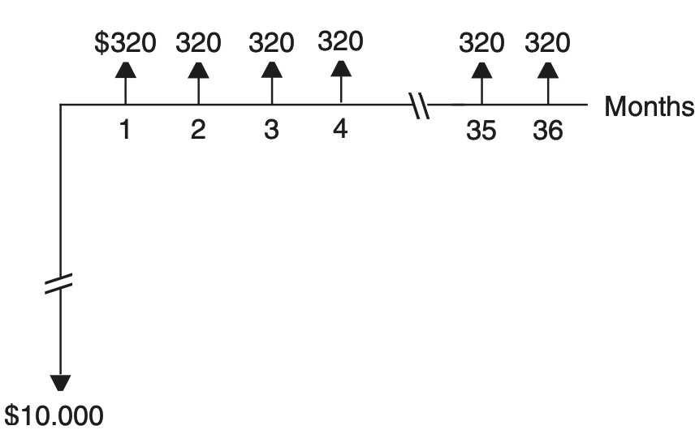
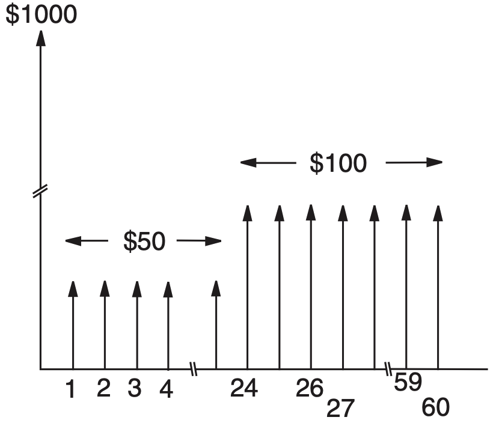

<!-- Marp for VS Code v1.5.2 -->

<!-- headingDivider: 2 -->
<!-- _class: cover -->
# Calculations with Discount Factors

Teng-Jui Lin
Department of Chemical Engineering, University of Washington
**Process Design**

## Calculating interest rates using discount factors

**Turton Ex. 9.15** Given discrete cash flow diagram from the bank's point of view, what is the interest rate the bank is charging for this loan?

## Calculating future values using discount factors

**Turton Ex. 9.16** Money is invested in a savings account that pays a nominal interest rate of 6% p.a. compounded monthly. The account is opened with a deposit of $1000, and then deposits of $50 at the end of each month are made for a period of two years, followed by a monthly deposit of $100 for the following three years. What will the value of the savings account be at the end of the five-year period?

## Calculating future values using discount factors

**Turton Ex. 9.16** Money is invested in a savings account that pays a nominal interest rate of 6% p.a. compounded monthly. The account is opened with a deposit of $1000, and then deposits of $50 at the end of each month are made for a period of two years, followed by a monthly deposit of $100 for the following three years. What will the value of the savings account be at the end of the five-year period?

## Calculating interest rates and future values using discount factors

**Turton Ex. 9.17** An investment plan involved investing $8000/year for 40 years leading to retirement. The plan then provided $106,667/year for 20 years of retirement income.

(**a**) What yearly interest rate was used in this evaluation?
(**b**) How much money was invested in the retirement plan before withdrawals began?
