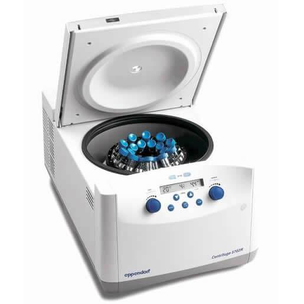

<!-- Marp for VS Code v1.5.2 -->

<!-- headingDivider: 2 -->
<!-- _class: cover -->
# Centrifugation

Teng-Jui Lin
Department of Chemical Engineering, University of Washington
**Separation Processes**

## Sedimentation is driven by gravity and follows Stoke's law at low velocity

- Sedimentation separates solid particles dispersed in liquid
- **Stoke's law** describes flow around a sphere at low velocity (Re < 1)
  - $\boxed{v_\infty = \dfrac{(\rho_p - \rho_f)}{18 \mu} D_p^2 \color{blue} g} \quad\quad$ for $\quad\quad \mathrm{Re} = \dfrac{D_p v_\infty \rho_f}{\mu} < 1$
    - $v_\infty$ - terminal velocity
    - $\rho_p$ - particle density
    - $\rho_f$ - fluid density
    - $\mu$ - fluid viscosity
    - $D_p$ - particle diameter
- Sedimentation is slow... How can we speed it up?

## Centrifugation is driven by centrifugal force and also follows Stoke's law
<!-- _class: seventy -->

- Centrifugation separates solid particles dispersed in liquid *faster*
- **Stoke's law** describes flow around a sphere at low velocity (Re < 1)
  - $\boxed{v_\infty = \dfrac{(\rho_p - \rho_f)}{18 \mu} D_p^2 \color{blue} \omega^2 r} \quad\quad$ for $\quad\quad \mathrm{Re} = \dfrac{D_p v_\infty \rho_f}{\mu} < 1$
    - $\omega$ - angular velocity of centrifuge bowl
    - $r$ - centrifuge bowl radius

  

- **G-force** normalizes centrifugal driving force by gravitational driving force
  - $\boxed{Z = \dfrac{\omega^2 r}{g}}$

## Sigma factor compares performance of continuous centrifuges of the same type
<!-- _class: twocol -->
- **Sigma factor** - effective area of a continuous centrifuge
  - $\boxed{\Sigma = \dfrac{\dot{V}}{2 v_\infty}}$

&nbsp;

- **Ex**. At small scale, cells can be centrifuged at $\Sigma_1 = 200$ and $\dot{V}_1 = 15 \ \mathrm{mL/min}$. At large scale, cells can be centrifuged at $\Sigma_2 = 9000$ and $\dot{V}_2 = 700 \ \mathrm{mL/min}$ at the same speed. The densities and viscosity are unchanged. Quantify the changed physical property.
