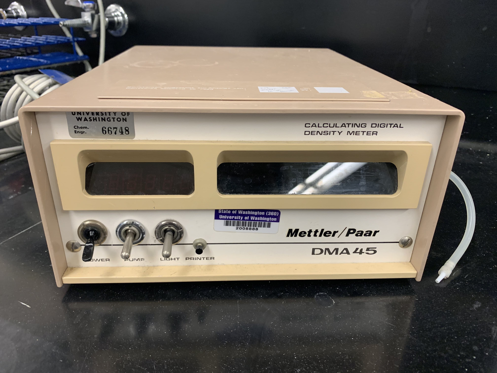
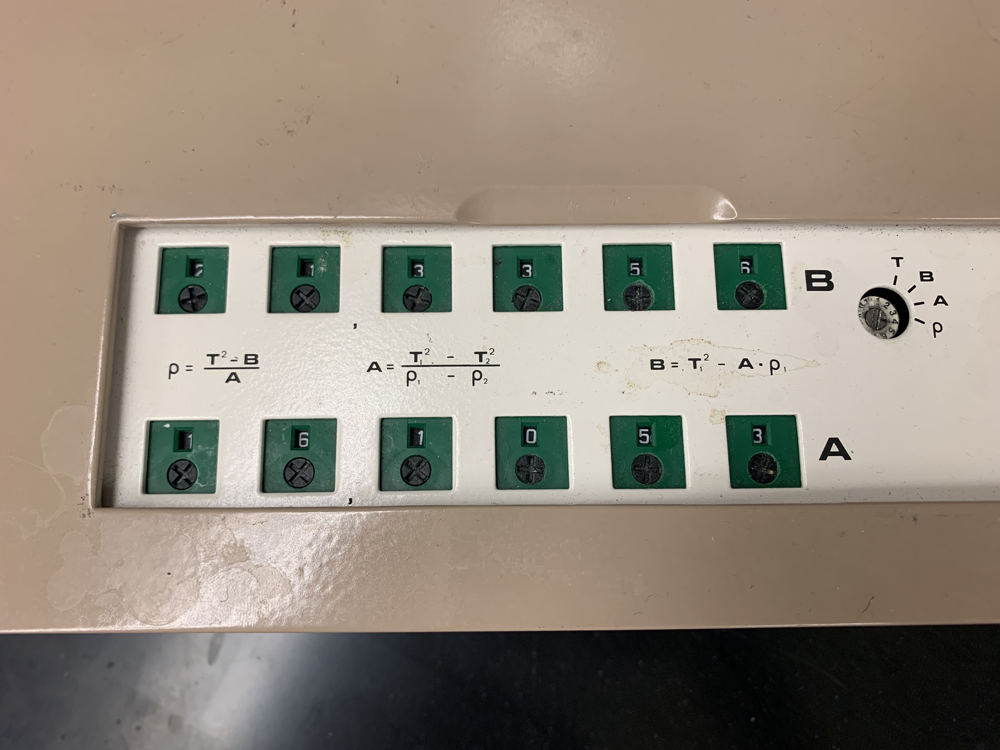
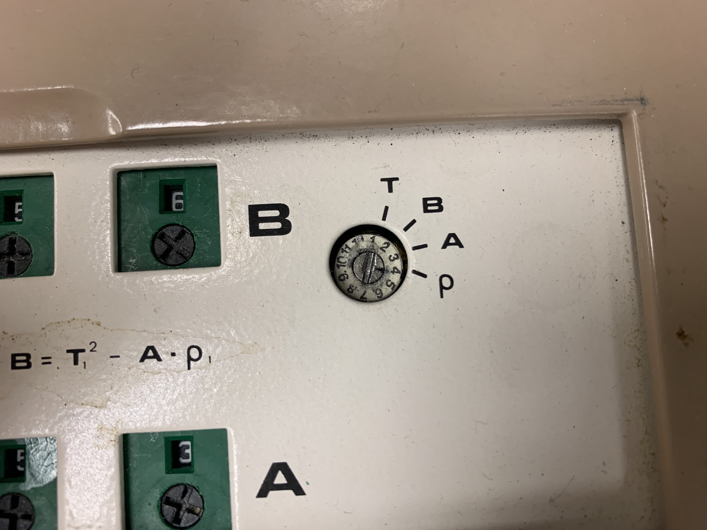
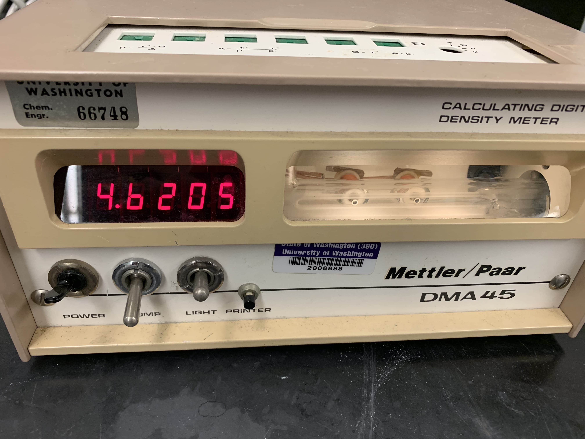
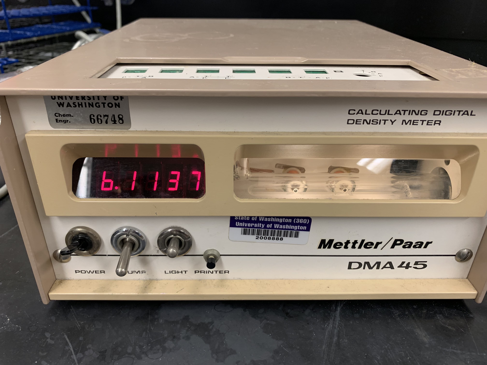

<!-- Marp for VS Code v2.6.0 -->

<!-- headingDivider: 2 -->
<!-- _class: cover -->
# Mettler/Paar DMA45 Densitometer   Calibration and Density Measurements

Teng-Jui Lin
Department of Chemical Engineering, University of Washington
**Surface and Colloid Science**

## Densitometer measures liquid densities

- Glass oscillator measures vibration period (direct) that relates to density (indirect)

## Densitometer calibration constants require vibration period and reference density
<!-- _class: twocol -->
- Calibration constants
  - $A = \dfrac{\tau_{\mathrm{H_2O}}^2 - \tau_{\text{air}}^2}{\rho_{\mathrm{H_2O}} - \rho_{\text{air}}}$
  - $B = \tau_{\text{air}}^2 - A \rho_{\text{air}}$
  - Water density (ITS-90 correlation)
    - $\rho_{\mathrm{H_2O}} (T) = A + BT + CT^2 + DT^3 \quad\quad$
  - Air density
    - $\rho_{\text{air}} (T) = \dfrac{P_{\text{air}}}{R_{\text{air}}T} + \dfrac{P_{\mathrm{H_2O}}}{R_{\mathrm{H_2O}}T}$
    - $R_i = \dfrac{R}{\mathcal{M}_i}$

 

- Water partial pressure (Relative humidity)
  - $P_{\mathrm{H_2O}} = P_{\mathrm{H_2O}}^* \mathrm{{RH}}$
  - Water saturation pressure (Antoine's equation)
    - $P_{\mathrm{H_2O}}^* (T) = \exp\left(A - \dfrac{B}{C + T}\right)$
- Dry air partial pressure
  - $P_{\mathrm{air}} = P - P_{\mathrm{H_2O}}$

## Top panel allows adjustment of calibration constants

 &nbsp; 

1. Calibration
   1. Use a screwdriver to switch densitometer to period mode (T)

## Measure period of air for calibration constants

1. Calibration (cont.)
   2. Turn on the densitometer
   3. Turn on the light
   4. Record the period of air when value stabilizes

## Measure period of water for calibration constants
<!-- _class: twocol -->
1. Calibration (cont.)
   5. Use a plastic syringe to draw >1 mL deionized water
   6. Remove all bubbles from the syringe
   7. Inject deionized water into the U-tube (avoid air bubbles!) fully, and leave the syringe on the side
   8. Record the period of water when value stabilizes or after 2 min

## Calculate calibration constants using period of water and air
<!-- _class: twocol -->
1. Calibration (cont.)
   9.  Use the provided spreadsheet to calculate the calibration constants
   10. Record the calibration constants

## Input the calibration constants into the densitometer and verify calibration
<!-- _class: twocol -->
1. Calibration (cont.)
   11. Use a screwdriver to change the calibration constants on the densitometer
   12. **Calibration is now complete!**
2. Verify the calibration
   1. Use a screwdriver to switch densitometer to density mode (ρ)
   2. Read the density measurement of water and compare to literature
   3. Draw out the water, and remove the syringe
   4. Turn on the pump and put the airline in the U-tube until the U-tube is dry
   5. Read the density measurement of air and compare to literature

## Measure density of unknown sample
<!-- _class: twocol -->
3. Measure density for samples of interest
   1. Follow the same procedure for getting samples into densitometer as calibration
   2. Draw samples, avoid air bubbles, and inject into U-tube
   3. Record density measurement when value stabilizes
   4. Draw out samples and rinse the U-tube with acetone
   5. Turn on the pump and put the airline in the U-tube until the U-tube is dry
   6. Note: rinse the syringe with deionized water between samples

## Shutting down the densitometer
<!-- _class: twocol -->
4. Densitometer shutdown
   1. When the U-tube is dry, turn off the pump
   2. Turn off the light
   3. Turn off the densitometer
   4. Place back the calibration panel lid, screwdriver, and syringe

## References

- Jones, F. E., & Harris, G. L. (1992). ITS-90 Density of Water Formulation for Volumetric Standards Calibration. Journal of Research of the National Institute of Standards and Technology, 97(3), 335–340. https://doi.org/10.6028/jres.097.013
- Koretsky, M. D. (2012). Engineering and Chemical Thermodynamics (2nd edition). Wiley.
- McVay, C. W. (1989). Determination of Density with the Paar Digital Density Meter. https://www.nrc.gov/docs/ML0329/ML032960458.pdf
- Richard Shelquist. (2023). Equations—Air Density and Density Altitude. https://wahiduddin.net/calc/density_altitude.htm
