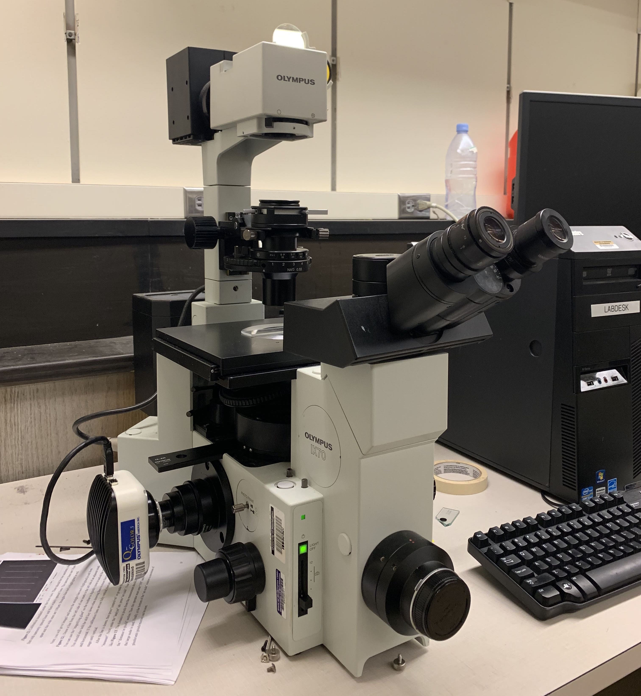
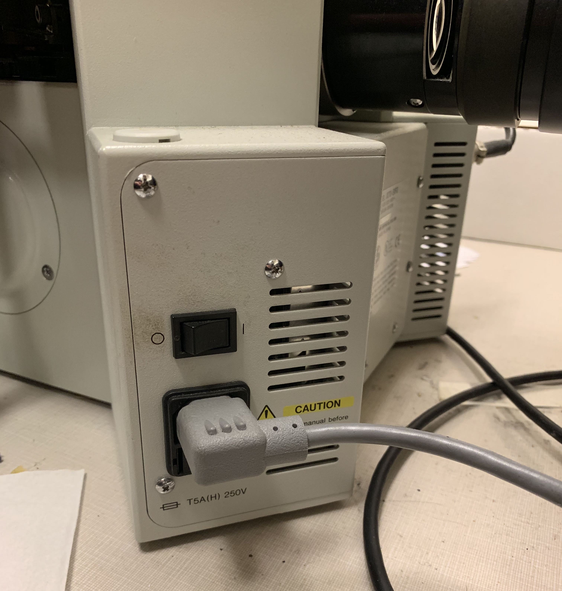
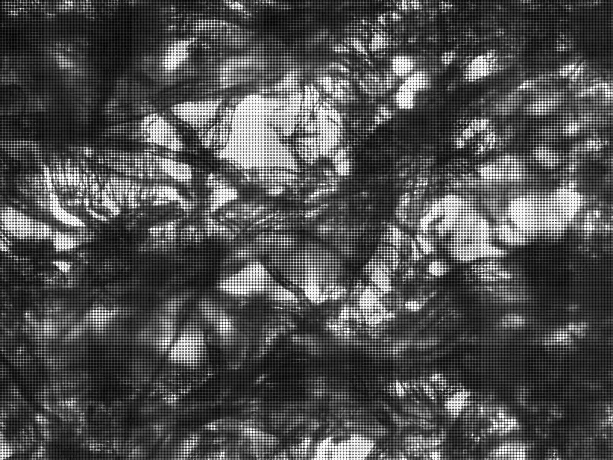
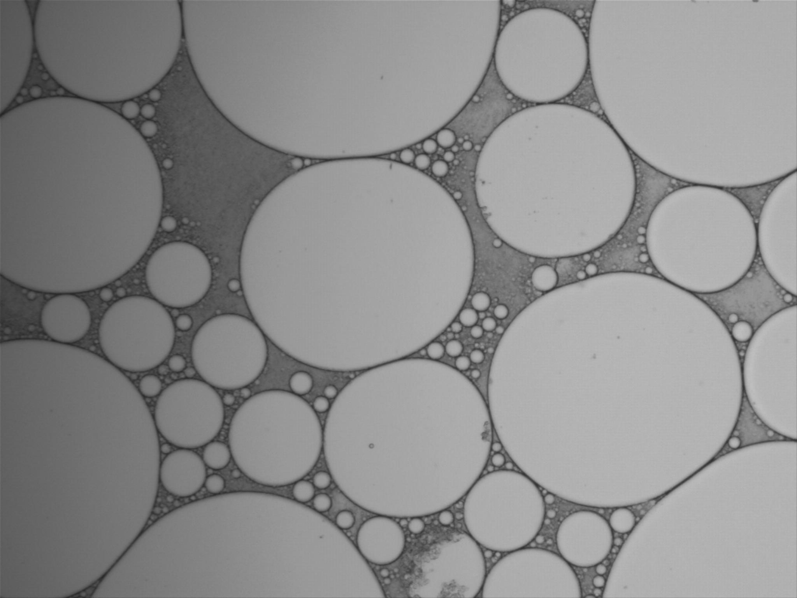

<!-- Marp for VS Code v2.6.0 -->

<!-- headingDivider: 2 -->
<!-- _class: cover -->
# Olympus IX70 Inverted Microscope

Teng-Jui Lin
Department of Chemical Engineering, University of Washington
**Surface and Colloid Science**

## Inverted microscope setup

 &nbsp; 

## Startup

## Basic operations: light, focus, position

- Turn on and adjust light
- Tune the focus
- Change stage position

## Calibration

- 2.940 px/μm
  - 10x objective
  - 1x eyepiece

## Shutdown

- Turn off the light
- Turn off the microscope

## Porous structure of kimwipe

## Emulsion
<!-- _class: twocol -->

