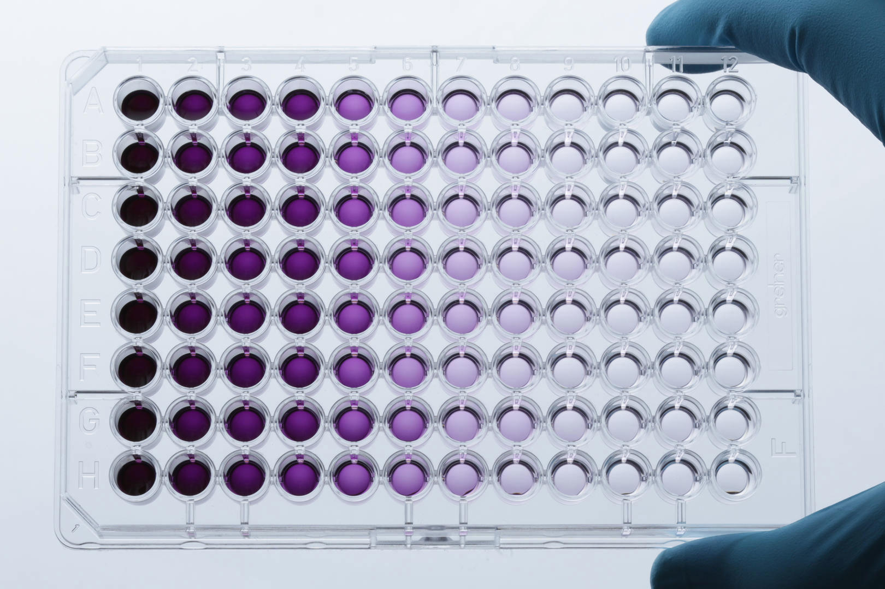
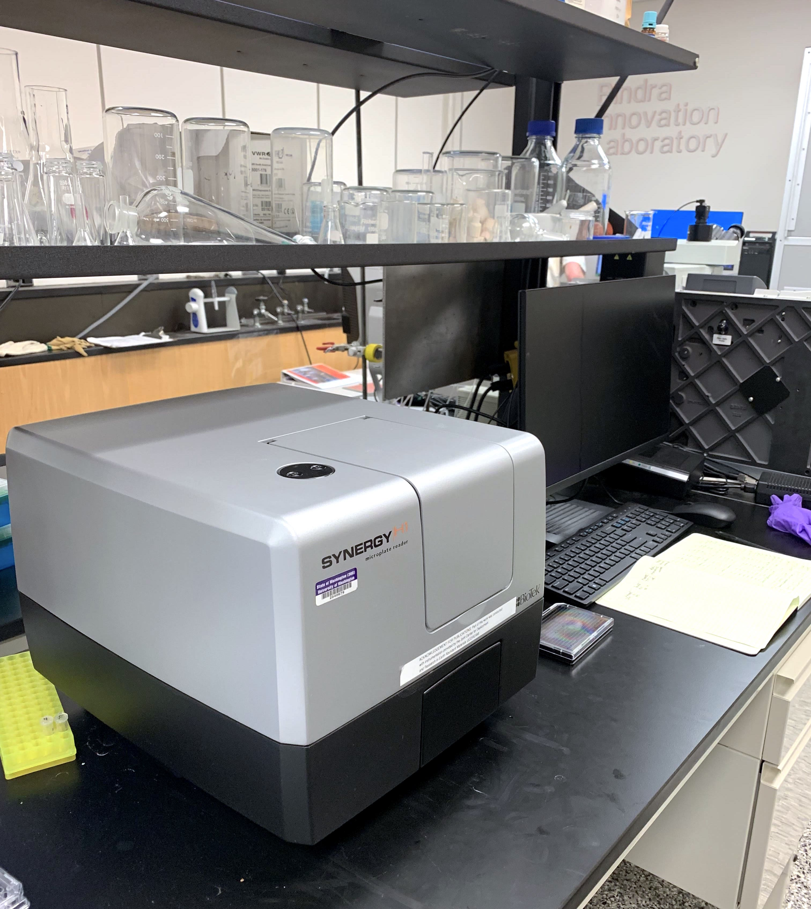
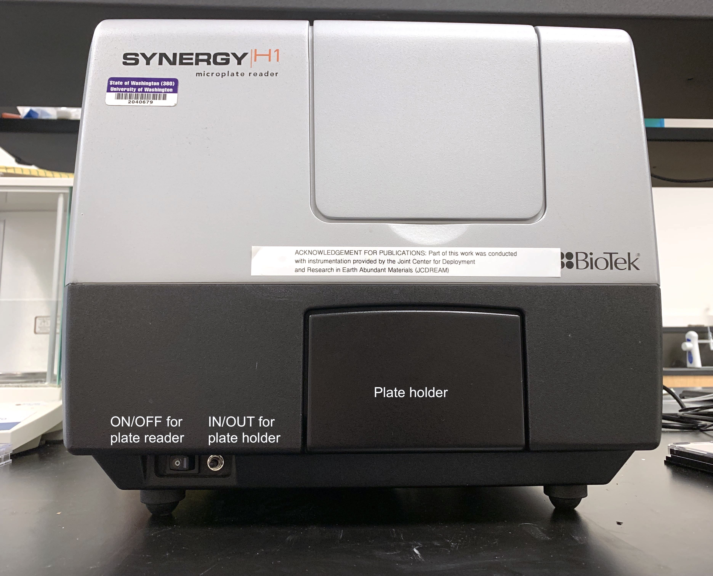
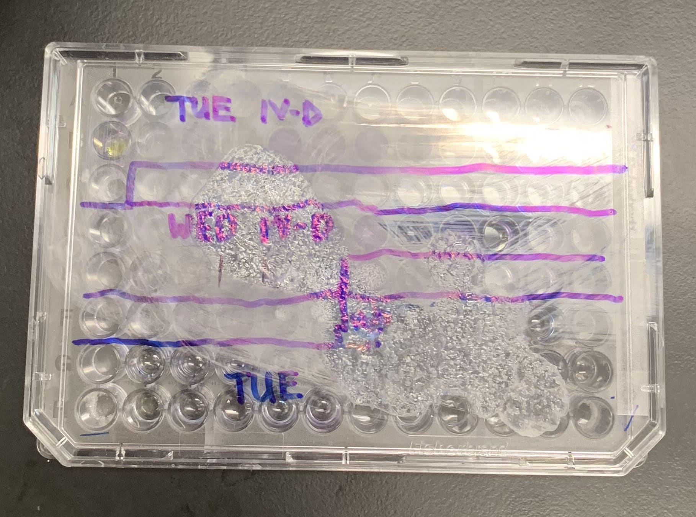
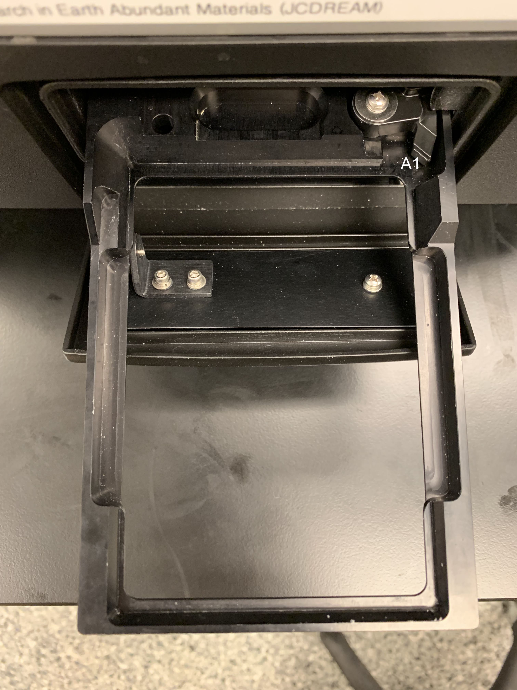

<!-- Marp for VS Code v2.6.0 -->

<!-- headingDivider: 2 -->
<!-- _class: cover -->
# BioTek Synergy H1 Microplate Reader   for Absorbance Measurements

Teng-Jui Lin
Department of Chemical Engineering, University of Washington
**Surface and Colloid Science**

## Beer-Lambert law relates absorbance and solution concentration linearly
<!-- _class: twocol -->
- **Intensity** $I$ - measure of how much light
- **Transmittance** $T$ - ratio of transmitted light vs. incident light  at a wavelength $\lambda$
  - $T = \dfrac{I}{I_0}$
- **Absorbance** $A$ - capacity of a substance to absorb light at a wavelength $\lambda$
  - $A = -\log_{10}(T) = -\log_{10}\left(\dfrac{I}{I_0}\right)$

 

- **Beer-Lambert law** - absorbance varies linearly with solution concentration and path length
  - $\boxed{A = \varepsilon bC}$
  - $\varepsilon$ - extinction coefficient
  - $b$ - path length
  - $C$ - solution concentration

## 96-well plates contains 200 µL sample of interest in each well
<!-- _class: twocol -->

- 200 µL sample in each well
- At least one blank control
- Avoid air bubble (reverse pipetting)
- Label the wells

## Microplate reader location, access, and training
<!-- _class: twocol -->

- The microplate reader (BioTek Synergy H1) is located in the Bindra Innovation Laboratory (Benson Hall 121).
- Book usage time on shared Google Calendar
- Log usage time on logbook

## Microplate reader startup
<!-- _class: twocol -->

- Turn on the microplate reader
  - Wait for self-diagnosis
  - Create empty Google Sheet
- Open "Gen5 3.09" software

## Plate reading settings - absorbance wavelength
<!-- _class: twocol -->
- Measurement mode (default)
  - Read method: Absorbance
  - Read type: Endpoint/Kinetic
  - Optics type: Monochromators
- Absorbance wavelength
  - Lab 3-1: CMC by Dye Titration
    - *λ* = 615 nm for pinacyanol chloride
  - Lab 3-3: Aggregation of Clay
    - *λ* = 860 nm for turbidity
  - Lab 4-4: Bubble Fractionation
    - *λ* = 590 nm for crystal violet

## Plate reading settings - plate layout
<!-- _class: twocol -->

- Plate Layout
  - Select “Blanks” and “Samples”

## Absorbance measurement
<!-- _class: twocol -->

- Place the plate into the plate holder
  - A1 well is on the top right.
- Read the plate using computer software
- Remove the plate from the plate holder.

## Data recording
<!-- _class: twocol -->
- Export the data in both matrix and stats form
  - Use blank-subtracted absorbance

## Microplate reader shutdown
<!-- _class: twocol -->
- Close all programs on the computer.
- Push the IN/OUT button for the plate holder so the plate holder retracts.
- Push the ON/OFF button for the plate reader so the instrument is turned off.

## Absorbance measurements for Surface and Colloid Science Laboratory
<!-- _class: twocol -->
- Lab 3-1: CMC by Dye Titration
  - *λ* = 615 nm for pinacyanol chloride
  - Look for changes in linear trend of absorbance
- Lab 3-3: Aggregation of Clay
  - *λ* = 860 nm for turbidity
  - Need calibration curve
- Lab 4-4: Bubble Fractionation
  - *λ* = 590 nm for crystal violet
  - Need calibration curve
