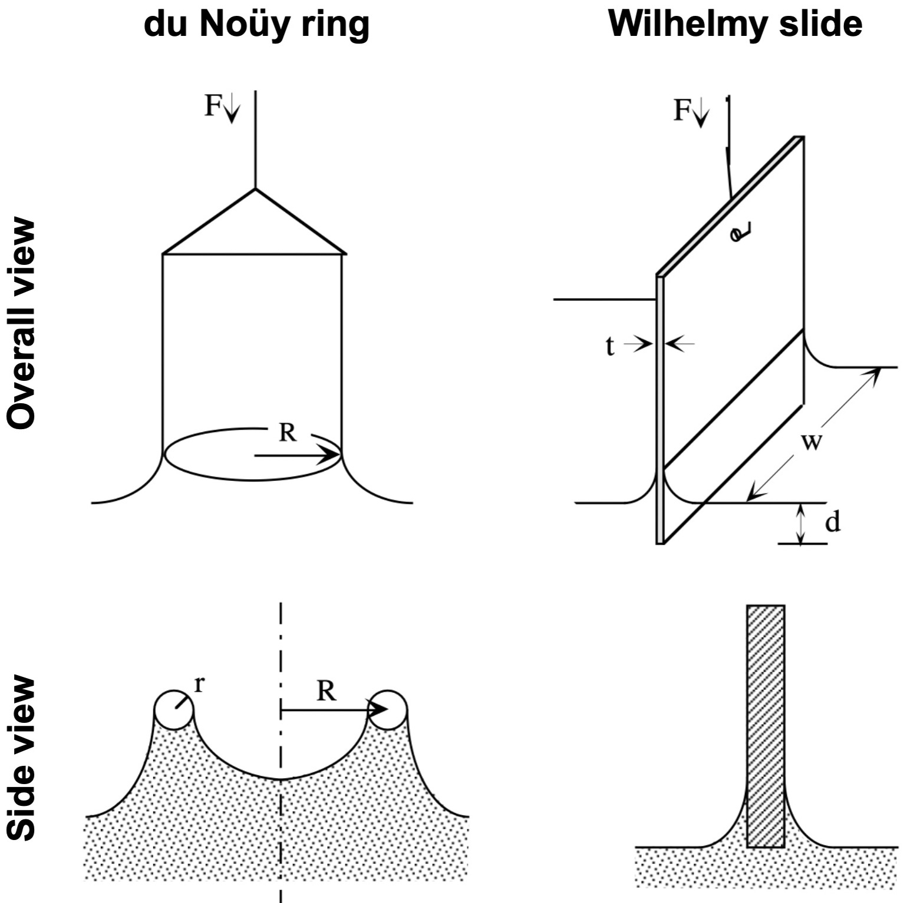
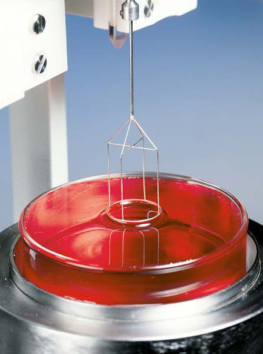
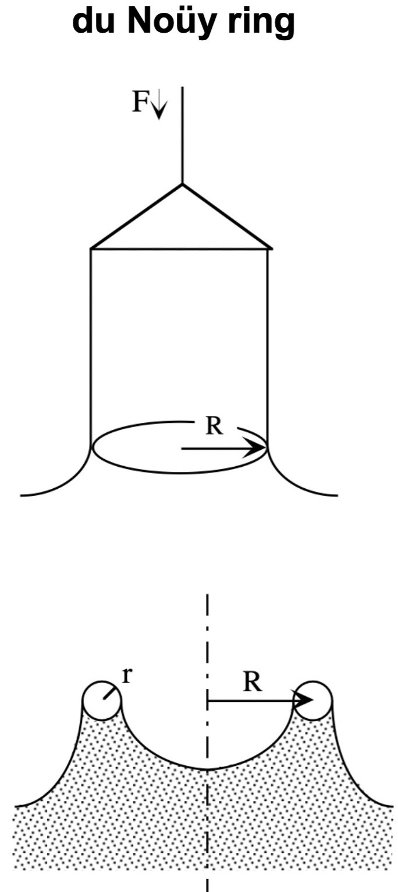
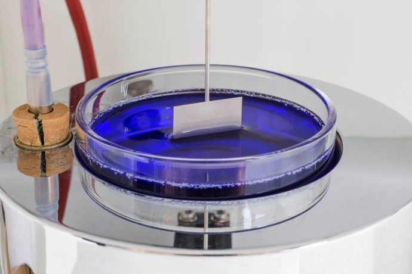
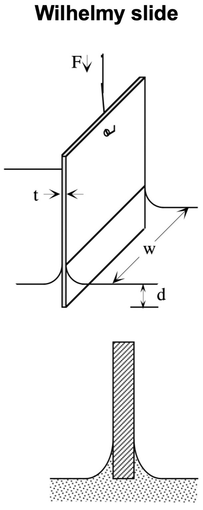
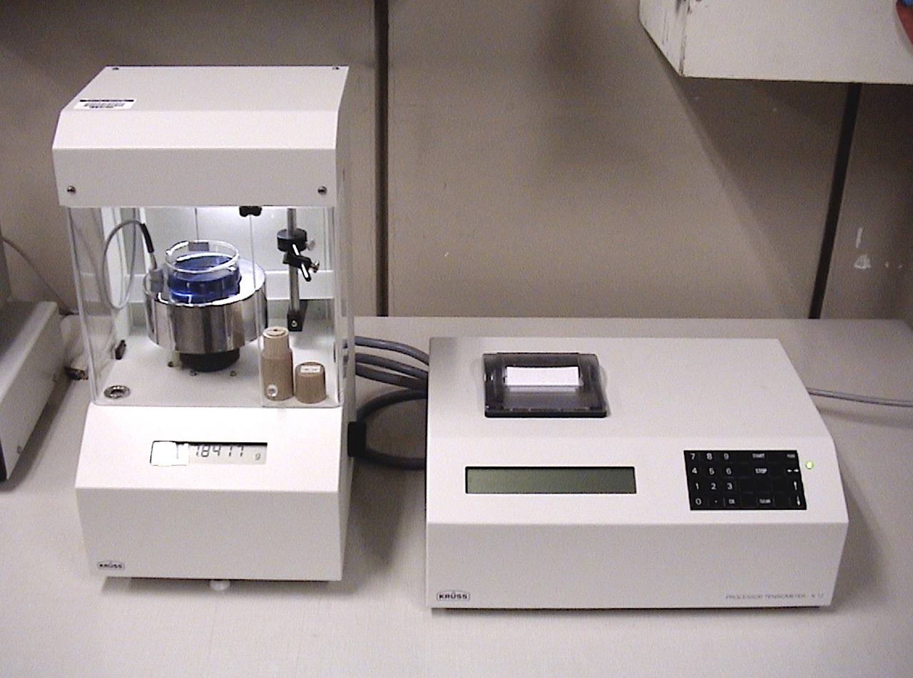

<!-- Marp for VS Code v1.5.2 -->

<!-- headingDivider: 2 -->
<!-- _class: cover -->
# Surface Tension Measurements by Detachment and Partial Immersion Methods

Teng-Jui Lin
Department of Chemical Engineering, University of Washington
**Surface and Colloid Science**

## Surface tension can be measured from force methods
<!-- _class: twocol -->

- Detachment method (du Noüy ring)
  - Force required to pull a solid completely through a fluid interface
- Partial immersion method (Wilhelmy slide)
  - Force required to maintain the position of a solid which penetrates a fluid interface
- Force balance
  - Down = Weight - Buoyancy + Surf. Tension
    - $F_{\downarrow} = F_g - F_b + F_\sigma$
    - $F_{\downarrow} = mg - \rho g V_{\text{disp}} + P\sigma$
  - Assumes: uniform $\sigma$, fully wetted $\theta = 0$

## du Noüy ring can be used to measure $\sigma$ by the detachment method
<!-- _class: sixty -->

- Force balance
  - $\begin{aligned}F_{\downarrow} &= mg - \rho g V_{\text{disp}} + P\sigma \\ &= mg - 0 + 2\pi[(R + r) + (R - r)]\sigma \\ &= mg + 4\pi R\sigma \end{aligned}$
- Uncorrected surface tension $\sigma^*$
  - $\sigma^* = \dfrac{F_{\downarrow} - mg}{4\pi R}$
- Correction factor $F$ [cgs unit]
  - $F_{\downarrow} = mg + \dfrac{4\pi R\sigma}{F}$
  - $F = 0.725 + \sqrt{\dfrac{0.01425 \sigma^*}{(2\pi R)^2 (\rho_l - \rho_{\text{air}})} + 0.04534 - \dfrac{1.679}{R/r}}$

## Wilhelmy slide can be used to measure $\sigma$ by the partial immersion method
<!-- _class: twocol -->

- Force balance ($d = 0, t \ll w$)
  - $\begin{aligned}F_{\downarrow} &= mg - \rho g V_{\text{disp}} + P\sigma \\ &= mg - \rho g twd + 2 (w + t)\sigma \\ &= mg + 2w\sigma\end{aligned}$

## Tensiometer is used to measure force on du Noüy rings and Wilhelmy slides

