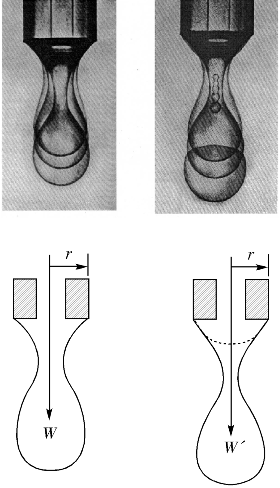
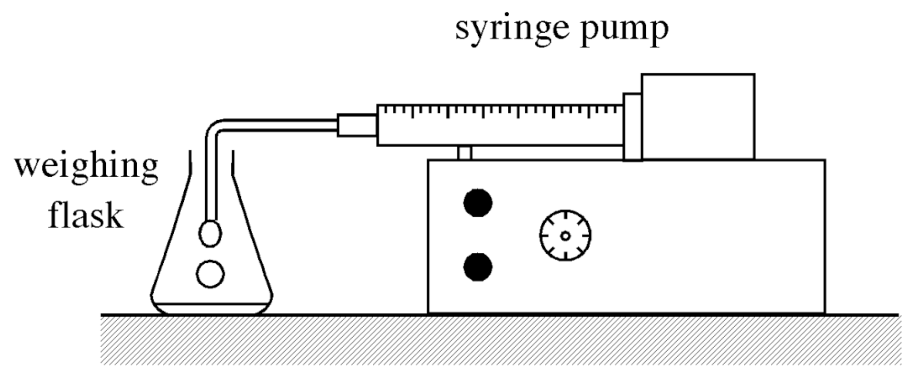
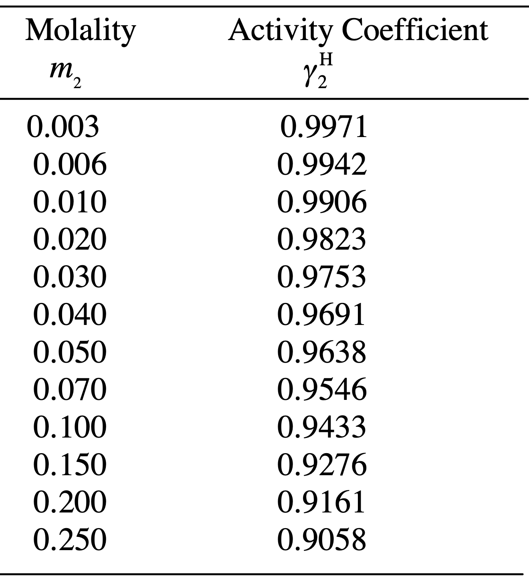

<!-- Marp for VS Code v1.5.2 -->

<!-- headingDivider: 2 -->
<!-- _class: cover -->
# Surface Tension Measurement and Adsorption Isotherm Determination Using the Drop Weight Method

Teng-Jui Lin
Department of Chemical Engineering, University of Washington
**Surface and Colloid Science**

## Surface tension calculation from the drop weight method
<!-- _class: sixty -->

- Tate (1864)
  - $W = 2\pi r\sigma$
- Harkins and Brown (1919)
  - $W = 2\pi r\sigma f = \dfrac{r\sigma}{F}$
  - $F \equiv \frac{1}{2} \pi f$
- Heertjes et al. (1971)
  - $F = 0.14782 + 0.27896 \left(\dfrac{r}{V^{1/3}}\right) - 0.1662 \left(\dfrac{r}{V^{1/3}}\right)^2$
  - Constraint: $\left(\dfrac{r}{V^{1/3}}\right) \in (0.3, 1.2)$
- Surface tension
  - $\sigma = \dfrac{V \vert \rho_2 - \rho_1 \vert gF}{r}$

## Szyszkowski equation describes surface tension of binary aqueous solutions
<!-- _class: sixty -->
- Szyszkowski equation
  - $\sigma = \sigma_0 - RTB\ln\left(1 + \dfrac{m_2}{a}\right)$

## Adsorption isotherm is modeled by Gibbs adsorption equation
<!-- _class: sixty -->
- Gibbs adsorption equation: ideal solution
  - $\Gamma_{2, 1} = -\dfrac{x_2}{RT} \dfrac{d\sigma}{dx_2}$
- Gibbs adsorption equation: ideal dilute solution
  - $\Gamma_{2, 1} = -\dfrac{m_2}{RT} \dfrac{d\sigma}{dm_2}$
- General Gibbs adsorption equation
  - $\Gamma_{2, 1} = -\dfrac{m_2}{RT \left[ 1 + \dfrac{d \ln \gamma_2^H}{d \ln m_2}\right]} \dfrac{d\sigma}{dm_2}$

## Objective: Determining concentration dependence of surface tension

- Surface tension of water and aqueous solutions
  - $\sigma = \dfrac{mg}{r} F(r, V)$
  - $F = 0.14782 + 0.27896 \left(\dfrac{r}{V^{1/3}}\right) - 0.1662 \left(\dfrac{r}{V^{1/3}}\right)^2$
- Surface tension of aqueous n-butanol solution vs. concentration
  - Determine Szyszkowski parameters $a$ and $B$
  - $\sigma = \sigma_0 - RTB\ln\left(1 + \dfrac{m_2}{a}\right)$

## Objective: Constructing adsorption isotherms
<!-- _class: sixty -->
- Relative adsorption of n-butanol at air-water interface vs. concentration (adsorption isotherm)
- Ideal dilute Gibbs adsorption equation
  - $\Gamma_{2, 1} = -\dfrac{m_2}{RT} \dfrac{d\sigma}{dm_2}$
- General Gibbs adsorption equation
  - $\Gamma_{2, 1} = -\dfrac{m_2}{RT \left[ 1 + \dfrac{d \ln \gamma_2^H}{d \ln m_2}\right]} \dfrac{d\sigma}{dm_2}$

## Objective: Determining factors affecting surface tension

- Surface tension of water vs. nozzle size
- Surface tension of water vs. drop formation time
- Surface tension of 0.01 mM Triton X-100 surfactant solution vs. drop formation time
- Compare surface tension measured by various techniques
  - Drop weight, du Noüy ring, Wilhelmy slide, sessile/pendant drop
