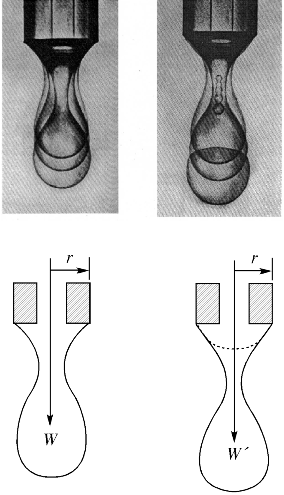
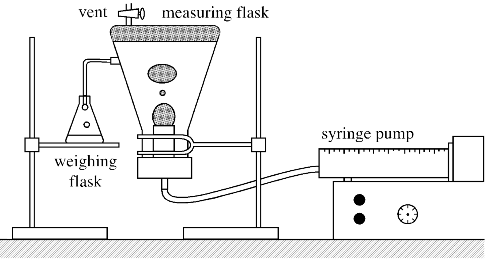

<!-- Marp for VS Code v1.5.2 -->

<!-- headingDivider: 2 -->
<!-- _class: cover -->
# Interfacial Tension Measurement and Adsorption Isotherm Determination Using the Inverted Drop Weight Method

Teng-Jui Lin
Department of Chemical Engineering, University of Washington
**Surface and Colloid Science**

## Surface tension calculation from the drop weight method
<!-- _class: sixty -->

- Tate (1864)
  - $W = 2\pi r\sigma$
- Harkins and Brown (1919)
  - $W = 2\pi r\sigma f = \dfrac{r\sigma}{F}$
  - $F \equiv \frac{1}{2} \pi f$
- Heertjes et al. (1971)
  - $F = 0.14782 + 0.27896 \left(\dfrac{r}{V^{1/3}}\right) - 0.1662 \left(\dfrac{r}{V^{1/3}}\right)^2$
  - Constraint: $\left(\dfrac{r}{V^{1/3}}\right) \in (0.3, 1.2)$
- Surface tension
  - $\sigma = \dfrac{V \vert \rho_2 - \rho_1 \vert gF}{r}$

## Interfacial tension between liquids is measured with inverted drop weight method

- Interfacial tension
  - $\sigma = \dfrac{V \vert \rho_2 - \rho_1 \vert gF}{r}$
  - $F = 0.14782 + 0.27896 \left(\dfrac{r}{V^{1/3}}\right) - 0.1662 \left(\dfrac{r}{V^{1/3}}\right)^2$

## Szyszkowski equation describes surface tension of binary aqueous solutions
<!-- _class: sixty -->
- Szyszkowski equation
  - $\sigma = \sigma_0 - RTB\ln\left(1 + \dfrac{C_2}{a}\right)$

## Adsorption isotherm is modeled by Gibbs adsorption equation
<!-- _class: sixty -->
- Gibbs adsorption equation: ideal dilute solution
  - $\Gamma_{2, 1} = -\dfrac{C_2}{RT} \dfrac{d\sigma}{dC_2}$
- Finite difference method
  - $\dfrac{d\sigma}{dC_2} = \dfrac{\Delta \sigma}{\Delta C_2} = \dfrac{\sigma_2 - \sigma_1}{C_{2, 2} - C_{2, 1}}$
- Szyszkowski equation
  - $\sigma = \sigma_0 - RTB\ln\left(1 + \dfrac{C_2}{a}\right)$
