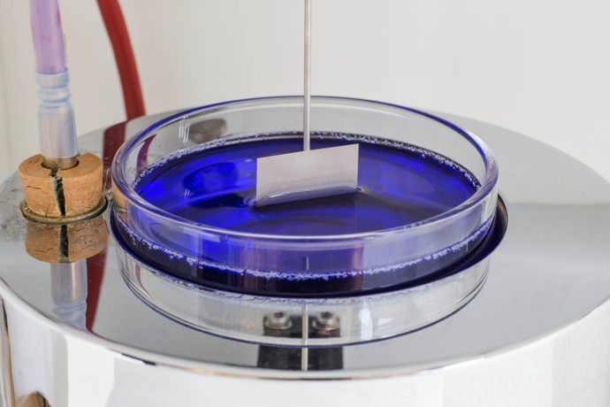
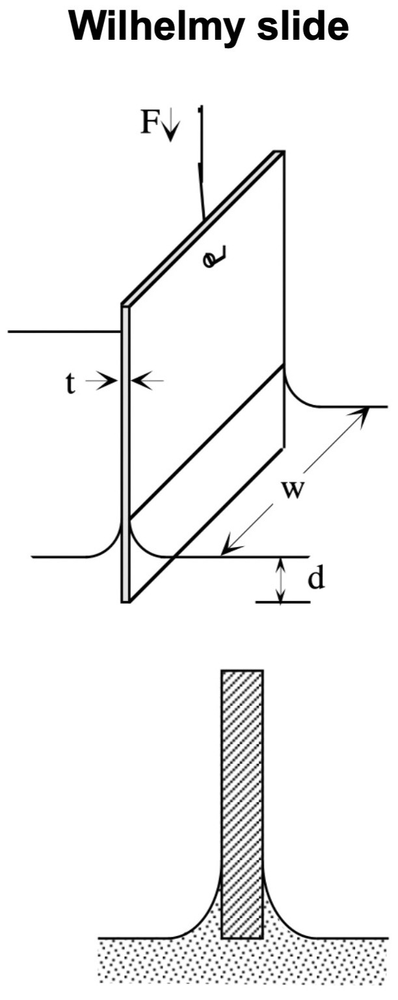
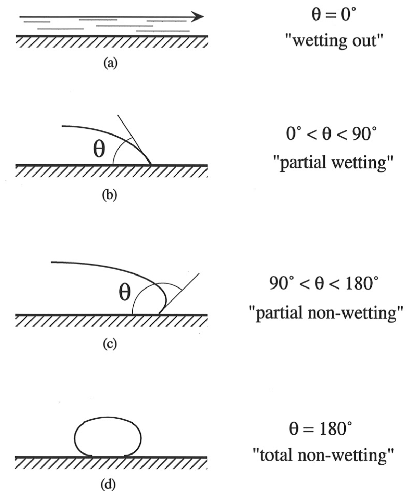
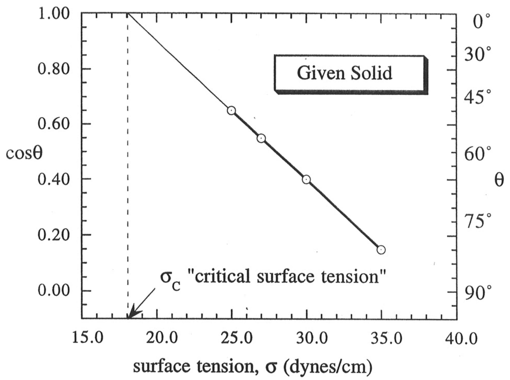

<!-- Marp for VS Code v1.5.2 -->

<!-- headingDivider: 2 -->
<!-- _class: cover -->
# Determining Contact Angles by Wilhelmy Method and Critical Surface Tension by Zisman Plot

Teng-Jui Lin
Department of Chemical Engineering, University of Washington
**Surface and Colloid Science**

## Surface tension can be measured by partial immersion (Wilhelmy) method
<!-- _class: twocol -->

- Partial immersion method (Wilhelmy slide)
  - Force required to maintain the position of a solid which penetrates a fluid interface
- Force balance
  - Down = Weight - Buoyancy + Surf. Tension
    - $F_{\downarrow} = F_g - F_b + F_\sigma$
    - $F_{\downarrow} = mg - \rho g V_{\text{disp}} + P\sigma$
  - Assumes: uniform $\sigma$, fully wetted $\theta = 0$

## Contact angle can also be measured by partial immersion (Wilhelmy) method
<!-- _class: sixty -->

- Force balance
  - Down = Weight - Buoyancy + Surf. Tension
    - $F_{\downarrow} = F_g - F_b + F_\sigma$
    - $F_{\downarrow} = mg - \rho g V_{\text{disp}} + P\sigma$
  - Assumes: uniform $\sigma$, ~~fully wetted~~ $\sout{\theta = 0}$
- Relax contact angle assumption
  - Contact angle as contribution to surface tension
    - $F_{\downarrow} = mg - \rho g V_{\text{disp}} + P \sigma \color{blue}\cos\theta$

 

- $P\sigma\cos\theta$
  - Know any two terms
  - Solve the other one
<!-- - Young's equation
  - $\cos\theta = \dfrac{\sigma_{sg} - \sigma_{sl}}{\sigma_{lg}}$ -->

## Contact angle of solid-liquid interactions is defined by pair-wise surface tensions
<!-- _class: sixty -->

- Horizontal force balance
  - $\theta \in (0, \pi] = (0, 180] \deg \quad \Rightarrow \quad \cos\theta \in (1, -1]$

 &nbsp;

- **Young's equation**
  - $\boxed{\cos\theta = \dfrac{\sigma_{sg} - \sigma_{sl}}{\sigma_{lg}}}$
  - Low energy surfaces - does not wet out by most liquids
    - Plastics, polymers
    - $(\sigma_{sg} - \sigma_{sl}) < \sigma_{lg}$
  - High energy surfaces - wet out by most liquids
    - Clean metals, mineral oxides
    - $(\sigma_{sg} - \sigma_{sl}) > \sigma_{lg}$

## Zisman plot gives critical surface tension of low-energy solids using contact angles
<!-- _class: twocol -->

- $P\sigma\cos\theta$
  - Know $\sigma$ and $P$, solve for $\cos\theta$
- **Critical surface tension** $\sigma_c$ **of a solid** - surface tension at or below which solid can be totally wet out
  - $\sigma \le \sigma_c \quad \Rightarrow \cos\theta = 1 \quad \Rightarrow$ wet out
- Teflon has $\sigma_c = 19 \ \mathrm{mN/m}$
  - Can't be wetted by almost any liquid at room temperature
  - Water: *σ* = 72 mN/m
  - Oil: *σ* = 30 mN/m

> - Assumes:
>   - Liquid does not dissolve or swell solid
>   - Liquid does not interact specifically with solid
>   - Liquid vapor does not adsorb on solid

## Force method allows calculation of any variable in $P\sigma\cos\theta$ given the other two

- $F_{\downarrow} = mg - \rho g V_{\text{disp}} + \color{blue}P \sigma \cos\theta$
   
  - Measure perimeter $P$
    - Given $\sigma$, $\cos\theta$
  - Measure surface tension $\sigma$
    - Given $P$, $\cos\theta$
  - Measure contact angle $\theta$
    - Given $P$, $\sigma$
  - Measure critical surface tension $\sigma_c$
    - Given Zisman plot ($\cos\theta$ vs. $\sigma$)
