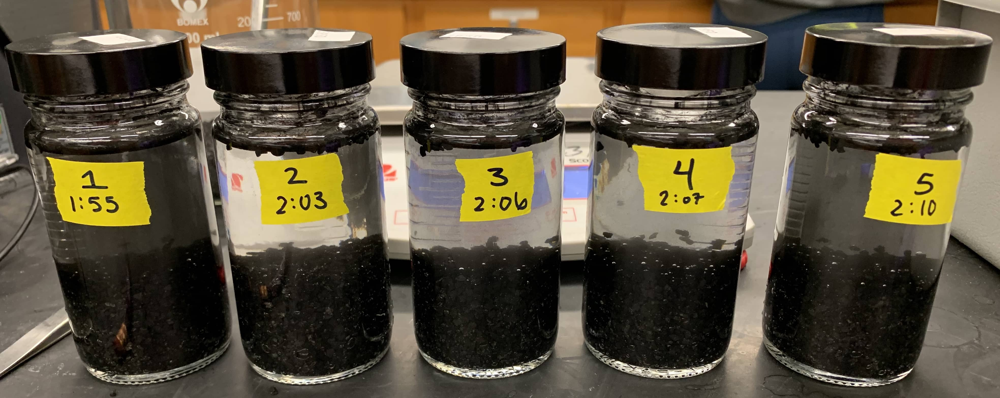
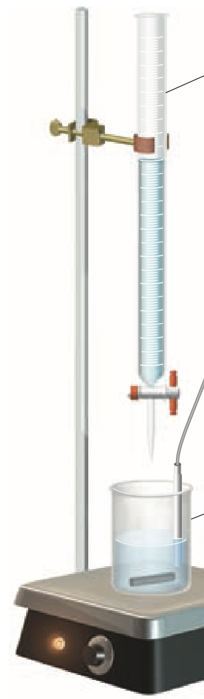
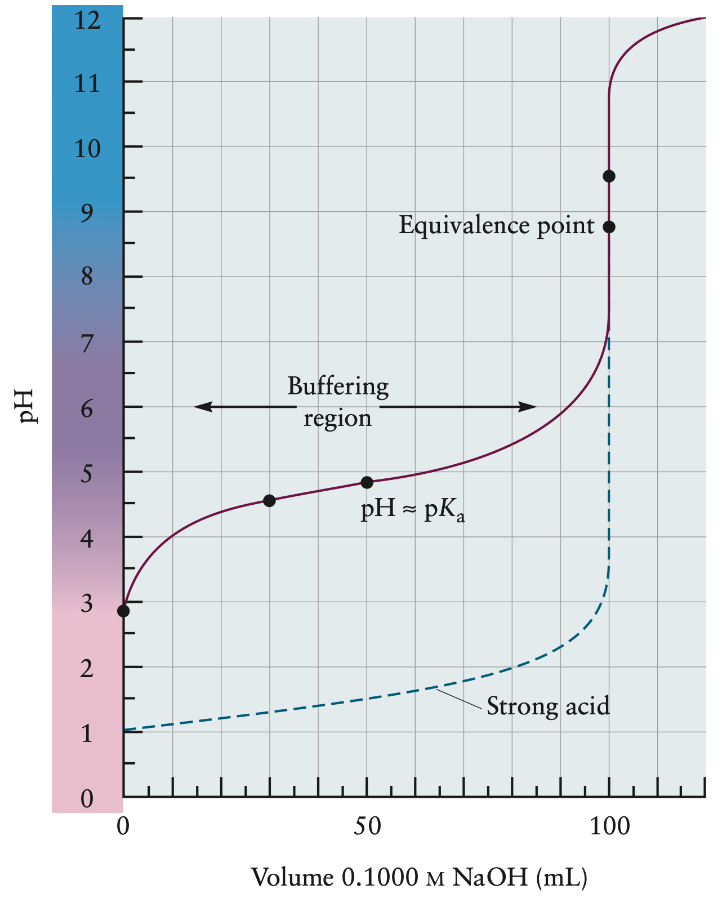

<!-- Marp for VS Code v1.5.2 -->

<!-- headingDivider: 2 -->
<!-- _class: cover -->
# Adsorption of Acetic Acid from Solution onto Activated Carbon

Teng-Jui Lin
Department of Chemical Engineering, University of Washington
**Surface and Colloid Science**

## Adsorption of solute to solid surface can be physical or chemical

- **Adsorption** - interaction between solute in dilute solution and solid surface
  - **Adsorbate** - solute
  - **Adsorbent** - solid
- **Chemisorption** - interaction by chemical bonding
- **Physical adsorption** - interaction by intermolecular forces (e.g. van der Waals forces)

## Titration determines the concentration of the acetic acid in the supernatant
<!-- _class: twocol -->
- Acetic acid equivalence point has pH = 8.7 (Why?)
- Phenolphthalein turns from colorless to pink at pH = 8.2 ~ 10.0
- Calculating acid concentration at equivalence point
  - $\begin{aligned}\text{mol acid} &= \text{mol base} \\ C_a V_a &= C_b V_b \\ C_a &= \dfrac{C_bV_b}{V_a}\end{aligned}$
- Estimate maximum volume of base needed to reach equivalence point
  - $V_b = \dfrac{C_aV_a}{C_b}$

 

> Oxtoby et al. *Principles of Modern Chemistry* 7th edition (2011).

## Langmuir adsorption isotherm $\Gamma(C)$ describes monolayer with homogeneous energy
<!-- _class: twocol -->
- Assumptions
  - Adsorption is restricted to a monolayer
    - Solid-solute interactions decays rapidly with distance
  - All adsorption sites are equivalent
    - Surface energy homogeneity - Energy of adsorption does not depend on extent of surface coverage
- Fraction of surface covered by adsorbed solute
  - $\Theta = \dfrac{kC}{1 + kC} = \dfrac{\Gamma}{\Gamma_m}$
- Langmuir isotherm
  - $\boxed{\Gamma = \Gamma_m \dfrac{kC}{1 + kC}}$

&nbsp;

- Linear form of Langmuir isotherm
  - $\dfrac{C}{\Gamma} = \dfrac{C}{\Gamma_m} + \dfrac{1}{k \Gamma_m}$
- Lineweaver-Burk plot
  - $\dfrac{1}{\Gamma} = \dfrac{1}{k \Gamma_m}\dfrac{1}{C} + \dfrac{1}{\Gamma_m}$

## Specific area of solid surface can be calculated from Langmuir isotherm

- Specific area of solid surface
  - $\Sigma(\mathrm{m^2/g}) = \Gamma_m(\mathrm{mol/g}) N_A A_0(\mathrm{\AA^2/molecule}) \times 10^{-20}$

## Freundlich isotherm $\Gamma(C)$ describes energy heterogeneity

- Assumptions
  - Surface energy heterogeneity - Energy of adsorption varies exponentially with extent of surface coverage
    - Low energy sites filled first
  - No limiting value of surface area - adsorption sites become less and less favorable
- Freundlich isotherm
  - $\boxed{\Gamma = \alpha C^\beta}$
- Linear form of Freundlich isotherm
  - $\log\Gamma = \log\alpha + \beta\log C$
