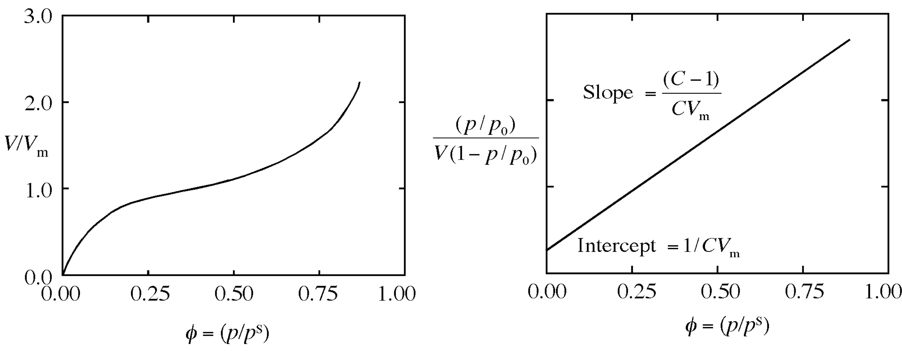

<!-- headingDivider: 2 -->
<!-- _class: cover -->
# BET (Brunauer-Emmett-Teller) Method for Surface Area Determination

Teng-Jui Lin
Department of Chemical Engineering, University of Washington
**Surface and Colloid Science**

## BET isotherms empirically fits adsorption isotherm data
<!-- _class: twocol -->
- BET method - procedure for determining surface area of finely divided solid by measurements of low-temperature gas adsorption
- BET isotherm
  - $\dfrac{V}{V_m} = \dfrac{C(p/p_0)}{(1 - p/p_0) [1 + (C-1)(p/p_0)]}$
- Linear form of BET isotherm
  - $\dfrac{(p/p_0)}{V(1 - p/p_0)} = \dfrac{1}{CV_m} + \dfrac{(C - 1)(p/p_0)}{CV_m}$

- Single point method: $C \gg 1$, so intercept $\approx 0$
  - Volume: $V_m = V(1 - p/p_0)$
  - Mass: $X_m = X(1 - p/p_0)$

## BET method allows surface area determination
<!-- _class: twocol -->
<!-- - $X = \dfrac{p_a V_c (A/A_c)}{RT}A_c$ -->
- Volume of adsorbate desorbed by sample
  - $V_{\text{des}} = V_c \dfrac{A}{A_c}$
- Mass of adsorbate desorbed
  - $X = \dfrac{p_a V_{\text{des}}}{RT} M_a$
- Mass of adsorbate desorbed when solid is covered by a single adsorbate monolayer
  - $X_m = \dfrac{p_a V_c (A/A_c)}{RT}A_c (1 - p/p_0)$
- Total surface area
  - $S_t = X_m \dfrac{N_0}{M_a}A_{cs}$
- Specific surface area
  - $\boxed{\Sigma = \dfrac{S_t}{m}}$

## Initial configuration of BET equipment

- Initial configuration
  - Power: OFF
  - Toggle valve: open
  - Sample holders are installed at DEGAS, TEST, and COLD TRAP locations
  - Insulating container is installed at sample holder for COLD TRAP

## Startup procedure for the BET instrument
<!-- _class: twocol -->
- Startup
  - Open inert gas flow (30% nitrogen, 70% helium), wait 5 min
  - Adjust flow meter to the calibration mark
  - Pour liquid nitrogen into an insulating container, and pour the liquid nitrogen to the insulating container at COLD TRAP, wait for 10 min
  - Power switch: ON, wait for 30 min

## Preparing activated carbon sample for BET measurement
<!-- _class: twocol -->
- Sample preparation
  - Weigh 0.02 g activated carbon in the sample holder
  - Place the sample holder on DEGAS and heat with a heating mantle, wait for 15 min (concurrent with start up)

## Calibrating the BET instrument
<!-- _class: twocol -->
- Calibration
  - Flush gas syringe with evaporated nitrogen gas above the liquid nitrogen at DEGAS
  - Fill the gas syringe with 1 mL nitrogen gas
  - Wipe needle tip free of frost, set aside needle to equilibrate to room temperature
  - Zero the instrument display, switch to surface area (SA), and clear SA display
  - Insert needle at INJECT, inject nitrogen gas at moderate rate, and withdraw
  - Wait until reading is stabilized, then calibrate the instrument to **SA = 2.84**
    - Confirm calibration by repeated injection, if necessary

## Measuring surface area of activated carbon with the BET method (adsorption)
<!-- _class: twocol -->
- Adsorption measurement
  - Exchange sample holders between DEGAS and TEST, so the sample is at TEST
  - Wait until readings stabilize and clear SA display
  - Pour liquid nitrogen into an insulating container
  - Place the insulating container at TEST by immersing the sample holder with liquid nitrogen. Secure the container by flipping on the container holder
    - Nitrogen gas starts to adsorb to activated carbon
  - Wait until reading is stabilized, **record the value of SA** = adsorption surface area

## Measuring surface area of activated carbon with the BET method (desorption)
<!-- _class: twocol -->
- Desorption measurement
  - Remove the insulating container by putting down the container holder
    - Nitrogen gas starts to desorb form activated carbon
  - Wait until reading is stabilized, **record the value of SA** = desorption surface area

## Shutdown procedure for the BET instrument
<!-- _class: twocol -->
- Shutdown
  - Power: OFF
  - Remove the activated carbon from the sample holder, and place the sample holder back on TEST
  - Turn off the inert gas flow

## Calculating the specific surface area of activated carbon

- Measured
  - $S_t$: Adsorption SA, desorption SA
  - $m$: Mass of activated carbon
- Calculated
  - $\boxed{\Sigma = \dfrac{S_t}{m}}$ - specific SA for adsorption and desorption
    - Usually use desorption data to report $\Sigma$