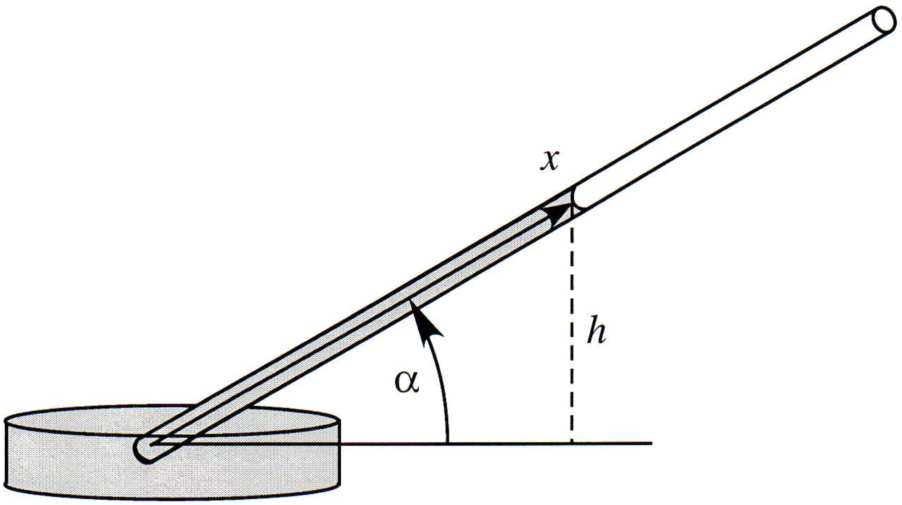

<!-- Marp for VS Code v1.5.2 -->

<!-- headingDivider: 2 -->
<!-- _class: cover -->
# Derivation of the Wicking Equation for Inclined Capillary

Teng-Jui Lin
Department of Chemical Engineering, University of Washington
**Surface and Colloid Science**

## Derivation of wicking equation for inclined capillary
<!-- _class: twocol -->

- Given the wicking distance
  - $X = \dfrac{H}{\sin\alpha} = \dfrac{2\sigma\cos\theta}{\rho gr \sin\alpha}$
- Use the Hagen-Poiseuille equation for inclined capillary
  - $\dfrac{dx}{dt} = \dfrac{r^2}{8\mu}\left[\dfrac{2\sigma\cos\theta}{rx} - \rho g \sin\alpha\right]$
- Verify that the wicking equation for inclined capillary is
  - $\boxed{t = \dfrac{8\mu X}{\rho g r^2}\dfrac{1}{\sin\alpha} \left[-\ln\left(1 - \dfrac{x}{X}\right) - \dfrac{x}{X}\right]}$

## Derivation of wicking equation for inclined capillary

## Washburn equation is recovered at small $x/X$ (far from equilibrium)
<!-- _class: twocol -->
- Verify that at small $x/X < 0.3$, the wicking equation reduces to the Washburn equation
  - $x = \sqrt{\dfrac{r\sigma\cos\theta}{2\mu} t}$
- with Taylor series approximation
  - $\ln(1-x) = \displaystyle\sum (-1)^n \dfrac{x^n}{n}$

## Washburn equation is recovered at small $x/X$ (far from equilibrium)
