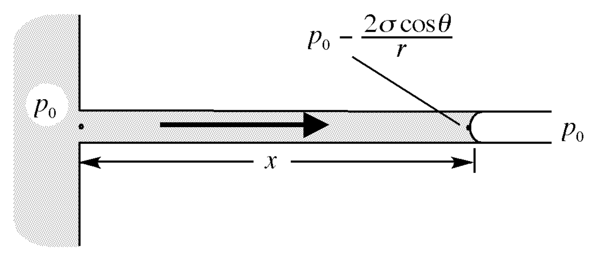
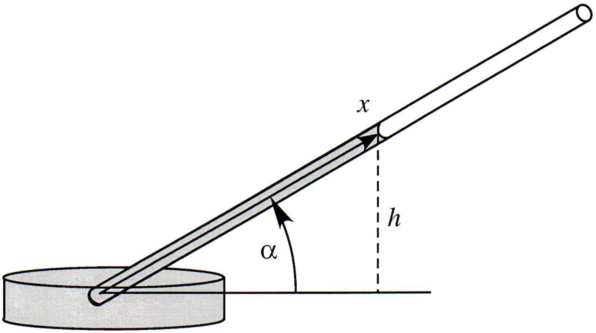
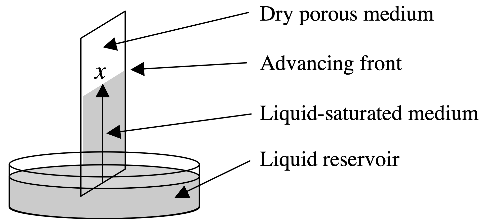
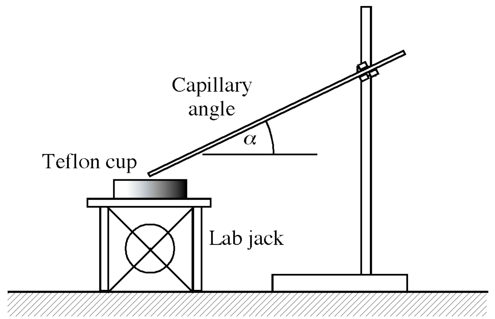

<!-- headingDivider: 2 -->
<!-- _class: cover -->
# Wicking Flow in Porous Media

Teng-Jui Lin
Department of Chemical Engineering, University of Washington
**Surface and Colloid Science**

## Wicking flow in a horizontal tube is driven by Young-Laplace pressure gradient

- Young-Laplace equation
  - $\boxed{\Delta p_c = \dfrac{2\sigma}{R_m}}$
  - Part-of-sphere approx
    - $R_m = \dfrac{r}{\cos\theta}$

## Washburn equation is derived from Hagen-Poiseuille equation

- Hagen-Poiseuille equation
  - $\boxed{v = \dfrac{r^2}{8\mu}\dfrac{dp}{dx}}$

     

- Washburn equation
  - $\boxed{x = k_W \sqrt{t}}$
  - Washburn constant
    - $k_W = \sqrt{\dfrac{r\sigma \cos\theta}{2\mu}}$

## Wicking flow in an inclined tube is affected by gravity

- Pressure drop
  - $\Delta p = \Delta p_c - \rho gh$
- Rise height
  - $\boxed{H = \dfrac{2\sigma \cos\theta}{\rho gr}}$
- Wicking distance
  - $X = \dfrac{H}{\sin\alpha} = \dfrac{2\sigma\cos\theta}{\rho gr \sin\alpha}$

## Wicking distance with respect to time in an inclined tube

- Hagen-Poiseuille equation
  - $\boxed{v = \dfrac{r^2}{8\mu}\dfrac{dp}{dx}}$

 

- Integrate
  - $t = \dfrac{8\mu X}{\rho g r^2}\dfrac{1}{\sin\alpha} \left[-\ln\left(1 - \dfrac{x}{X}\right) - \dfrac{x}{X}\right]$
- Taylor series approximation
  - $t \approx \dfrac{8\mu X}{\rho g r^2}\dfrac{1}{\sin\alpha} \left[ \dfrac{1}{2}\left(\dfrac{x}{X}\right)^2 + \mathcal{O} \left(\dfrac{x}{X}\right)^3\right]$
- Reduces to Washburn equation when $x/X$ is small

## Wicking flow in porous media can be approximated by Washburn analysis

- $\Delta p_c$ varies point to point, but Washburn analysis is good approx
  - $k_W = \sqrt{\dfrac{r_W \sigma\cos\theta}{2\mu}}$
  - $r_W$ - Wicking equivalent radius, effective cylindrical pore radius for Washburn analysis
    - One order of magnitude smaller than actual pore radius
    - Tortuosity correction - replace $x$ as $\tau x$
      - $x = \sqrt{\dfrac{r \sigma\cos\theta}{2\tau\mu} t} = \sqrt{\dfrac{r_W \sigma\cos\theta}{2\mu} t} \implies r_W = \dfrac{r}{\tau}$
- Gravity effect negligible due to small pore radius

## Experimental setup

- **Wear safety goggles at all times!**
- Variables: liquid, capillary radius, tilt angle
