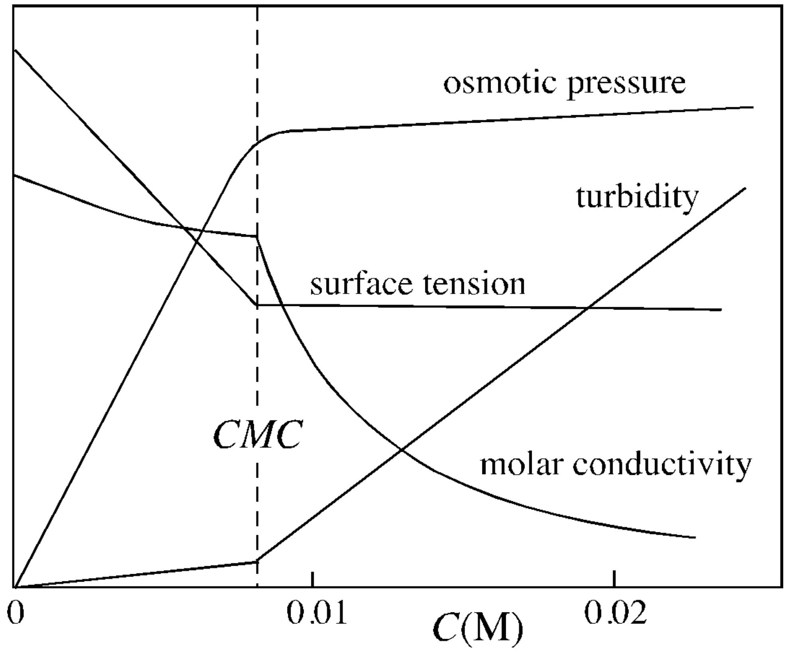

<!-- headingDivider: 2 -->
<!-- _class: cover -->
# Determination of Critical Micelle Concentration by Dye Titration

Teng-Jui Lin
Department of Chemical Engineering, University of Washington
**Surface and Colloid Science**

## Micelle formation changes physical properties
<!-- _class: twocol -->

- Micelle formation

&nbsp;

- Physical property of SDS at 25 °C

- CMC = critical micelle concentration

## Absorbance of pinacyanol chloride dye changes at CMC

- Absorbance at $\lambda = 615 \ \mathrm{nm}$
  - $A = -\log T \propto C$

## CMC decreases with positive counterion concentration

- CMC dependence on counterion molality
  - $\log\mathrm{CMC} = -a \log m^+ - b$
