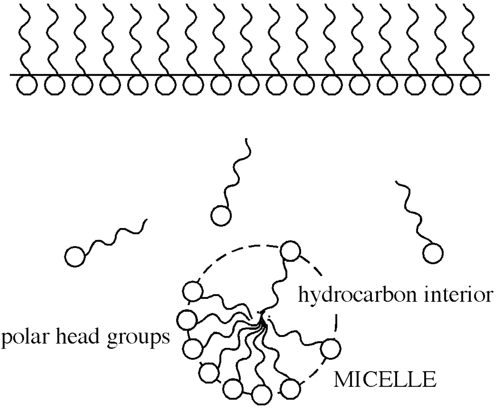
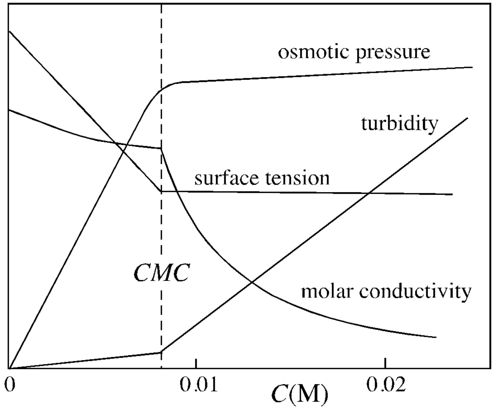

<!-- headingDivider: 2 -->
<!-- _class: cover -->
# Determination of Critical Micelle Concentration by Conductivity

Teng-Jui Lin
Department of Chemical Engineering, University of Washington
**Surface and Colloid Science**

## Micelle formation changes physical properties
<!-- _class: twocol -->

- Micelle formation

&nbsp;

- Physical property of SDS at 25 °C

- CMC = critical micelle concentration

## CMC can be determined using conductivity measurements

- Conductivity $\kappa [\mathrm{\mu S/cm}]$ increases linearly with concentration $C [\mathrm{M}]$
  - $\kappa = \kappa_0 + k_\kappa C$
- Equivalent conductivity $\Lambda [\mathrm{S \ cm^2 / mol}]$
  - $\Lambda = \dfrac{\kappa}{C}$
- Equivalent conductivity decreases linearly with square root of concentration
  - $\Lambda = \Lambda_0 - k_\Lambda\sqrt{C}$

## CMC decreases with alkyl chain length: Klevens equation

- Klevens equation: increasing alykl chain length $n$ decreases CMC
  - $\log\mathrm{CMC} = A - Bn$

## Surfactants of interest

|Surfactant|Chemical Formula|Number of alkyl chains n|Surfactant classification|Ionic classification|
|:-:|:-:|:-:|:-:|:-:|
|SDS|$\mathrm{CH_3(CH_2)_{11}OSO_3Na^+}$|12|Sodium alkyl sulfates|Anionic|
|DTAB|$\mathrm{CH_3(CH_2)_{11}N^+(CH_3)_3Br^–}$|12|Alkyl trimethyl ammonium bromides|Cationic|
|HTAB|$\mathrm{CH_3(CH_2)_{15}N^+(CH_3)_3Br^–}$|16|Alkyl trimethyl ammonium bromides|Cationic|
|OTAB|$\mathrm{CH_3(CH_2)_{17}N^+(CH_3)_3Br^–}$|18|Alkyl trimethyl ammonium bromides|Cationic|

## Experimental procedure

- Calibrate conductivity meter
- Wait 2 min for the *system* to equilibrate before recording the conductivity measurement
  - The equipment reading may have stabilized, but the system might not have reached equilibrium