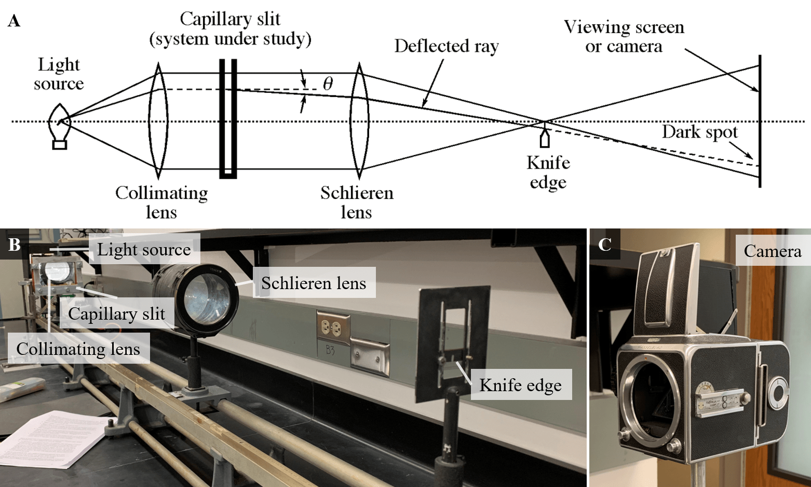

<!-- headingDivider: 2 -->
<!-- _class: cover -->
# Observing Marangoni Effect with Schlieren Optics

Teng-Jui Lin
Department of Chemical Engineering, University of Washington
**Surface and Colloid Science**

## Interfacial tension gradients drive spontaneous flow called Marangoni effect

- **Marangoni effect** - spontaneous flows due to interfacial tension gradients
  - Surface tension gradient caused by composition and/or temperature gradient
  - Surface tension gradient drives motion
- Generation of surface tension gradient
  - Self-amplification of small disturbances (instability)
  - Macroscopic asymmetry
    - Mass transfer across curved meniscus

## Schlieren optics

## Marangoni effect in liquid-air systems

- Surface tension gradient by temperature and concentration gradient

- Evaporation of pure acetone into air
  - Marangoni convection observed in liquid acetone surface
  - Nothing in air
  - Self-amplification
- Evaporation of isopropanol from 8 mol% isopropanol solution into air
  - Marangoni convection observed in liquid
  - Wine tears formed at interface
  - Nothing in air
- Evaporation of isopropanol from 80 mol% isopropanol solution into air
  - Marangoni convection at liquid interface
  - No wine tears
  - Nothing in air

## Marangoni effect in liquid-liquid-systems

- Surface tension gradient by density gradient

- Transfer of acetic acid from aqueous solution into toluene
  - No Marangoni effect
- Transfer of acetic acid from toluene solution into water
  - Marangoni effect is substantial
  - Convection becomes slower over time

## Marangoni convection of soap films and water films

- Needle puncture at different temperatures
- Needle puncture with different solvents

## Water film response

- Response of water film to liquid drop
