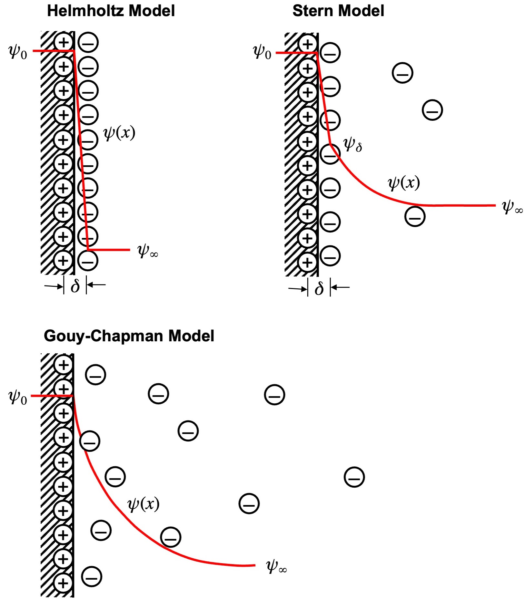
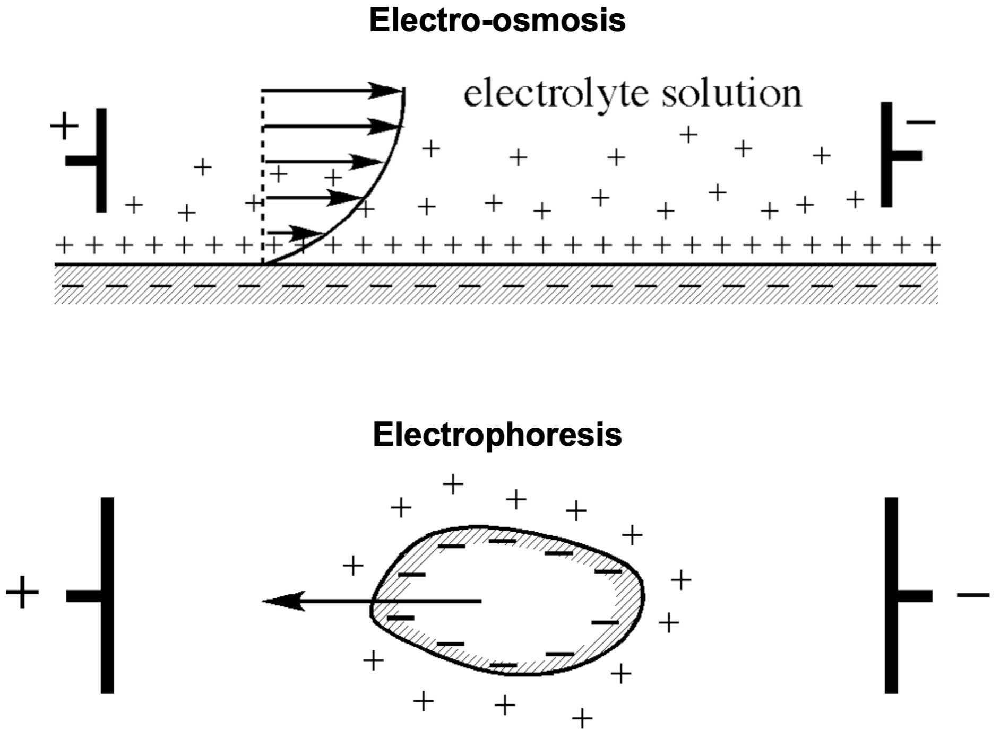
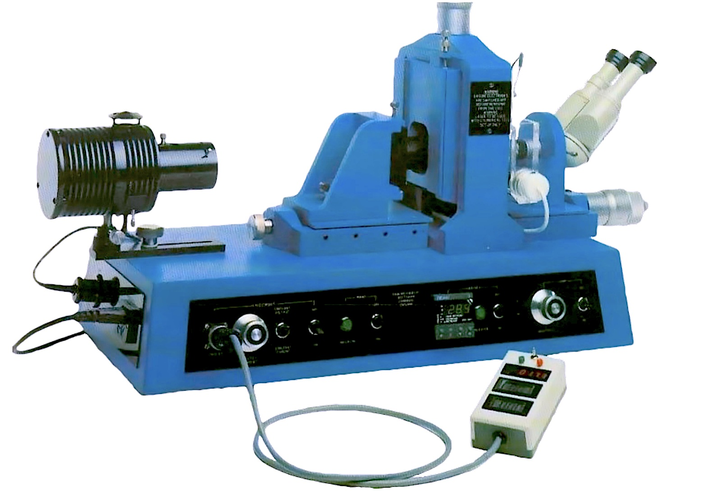
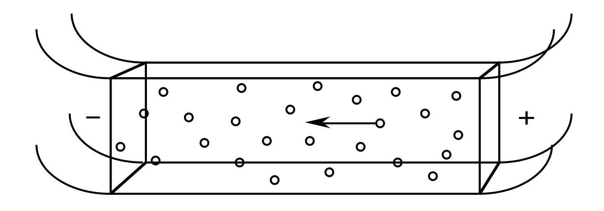
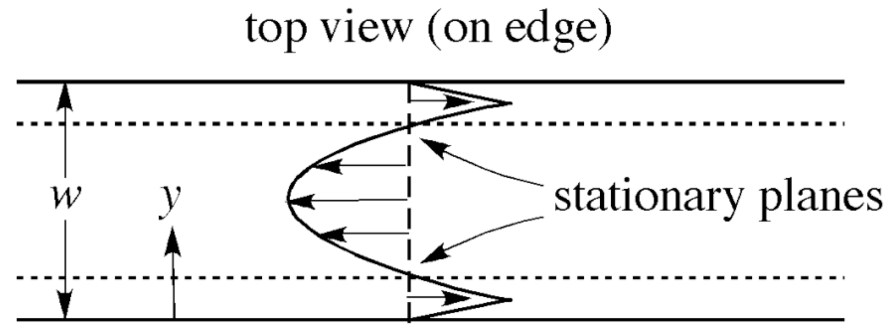
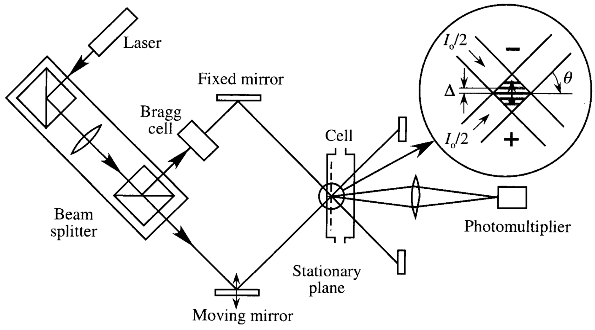
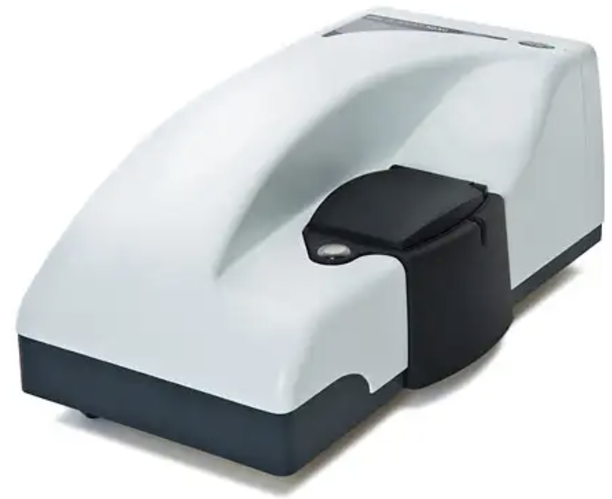

<!-- headingDivider: 2 -->
<!-- _class: cover -->
# Determination of Zeta Potential by Microelectrophoresis

Teng-Jui Lin
Department of Chemical Engineering, University of Washington
**Surface and Colloid Science**

## Zeta potential is the electrical potential at the slip plane of the electric double layer
<!-- _class: twocol -->

- $\psi$ - electrical potential difference between dispersing medium and ...
  - $\psi_\infty \equiv 0$ - the dispersing medium
  - $\psi_0$ - the surface of colloidal particle
    - True surface potential
  - $\psi_\delta$ - the outer first layer of counterions
    - Effective (Stern) surface potential
  - $\zeta$ - the slip plane (medium velocity = 0)
    - Zeta potential, electrokinetic potential
- The slip plane may be slightly further out into the solution than Stern layer
  - $\psi_\delta \approx \zeta$

## Electro-osmosis and electrophoresis give the same zeta potential
<!-- _class: twocol -->

- **Electro-osmosis** - diffuse layer of ions beside a charged immobile surface move under *E* field, which sets the liquid into motion by the action of viscosity
  - *Liquid* moves, *solid* at rest

 &nbsp;

- **Electrophoresis** - diffuse layer of ions beside a charged particle surface move under *E* field, which sets the particle into motion
  - *Solid* moves, *liquid* at rest

## Electrophoretic mobility allows determination of zeta potential

- **Electrophoretic mobility** - $u_E [\mathrm{(µm/s)/(V/cm)}]$
  - $u_E = \dfrac{V_p}{E_x} = \begin{cases}\dfrac{\varepsilon\varepsilon_0 \zeta}{\mu} & (\kappa a > 200) \\ \dfrac{2}{3}\dfrac{\varepsilon\varepsilon_0 \zeta}{\mu} & (\kappa a <0.1) \end{cases}$

>- $u_E$ - Electrophoretic mobility
>- $V_p$ - Particle velocity
>- $E_x$ - Electric field strength
>- $\varepsilon$ - Dielectric constant of the medium
>- $\varepsilon_0$ - Permittivity of free space
>- $\zeta$ - Zeta potential
>- $\mu$ - Viscosity of the medium
>- $\kappa$ - Debye length
>- $a$ - Particle radius

## Point of zero charge and isoelectric point define pH at which potentials are zero

- **Potential determining ions** - ions whose concentration determines surface potential
  - Crystalline solid - lattice ions
  - Oxides - $\mathrm{H_3O^+}$, $\mathrm{OH^-}$ (pH)
- **Point of zero charge (PZC)** - pH at which $\psi_0 = 0$
  - pH < PZC: $\psi_0 > 0$
  - pH > PZC: $\psi_0 < 0$
- **Isoelectric point (IEP, pI)** - pH at which $\zeta \approx \psi_\delta = 0$
  - $u_E = 0 \Rightarrow V_p = 0$

## Darkfield illumination microscopy visualizes colloidal particles under *E* field
<!-- _class: twocol -->

- $u_E = \dfrac{V_p}{E_x} = \dfrac{\varepsilon\varepsilon_0 \zeta}{\mu} \quad\quad (\kappa a > 200)$
  - $\boxed{\zeta = \dfrac{\mu V_p}{\varepsilon\varepsilon_0 E_x}}$
- Electrophoresis has solid particles moving when liquid is at rest ($v_x = 0$)
  
  - $v_x = 0$ when $y = \begin{cases} 0.205w \\ 0.795w \end{cases}$

## Laser Doppler electrophoresis determines zeta potential with more sensitivity

