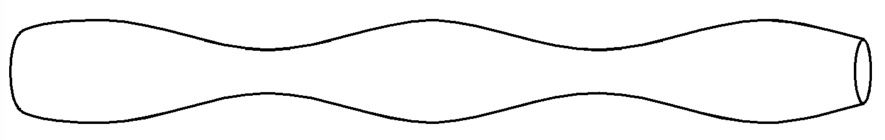
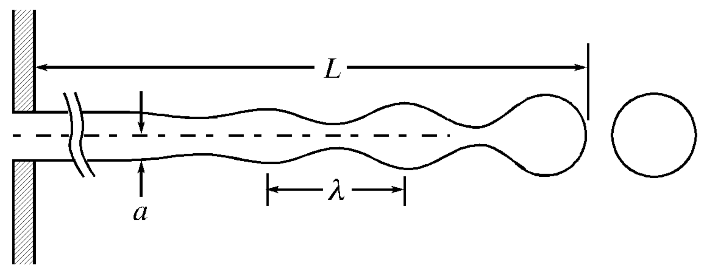
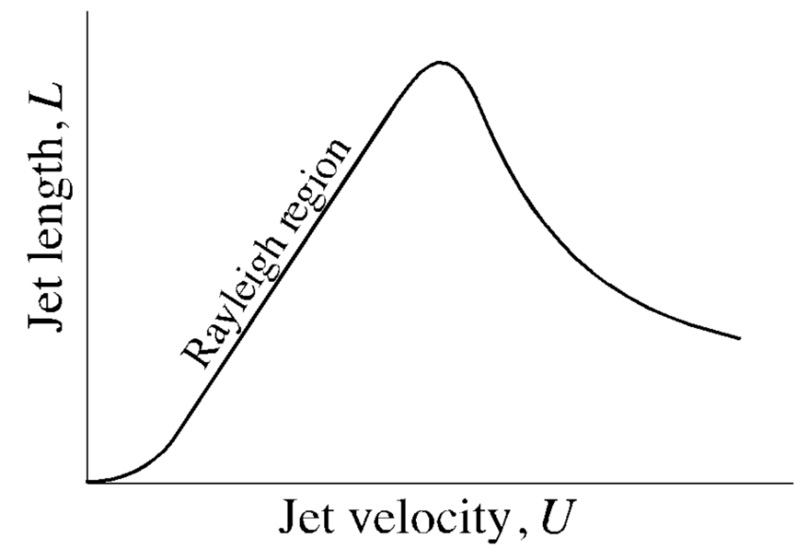
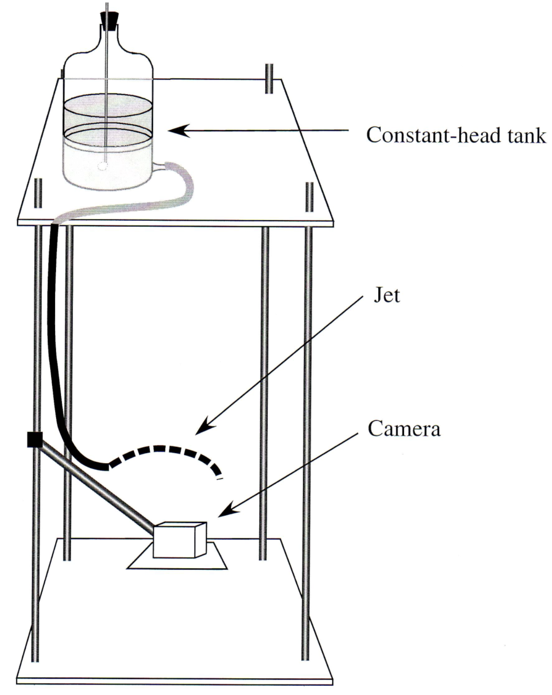

<!-- headingDivider: 2 -->
<!-- _class: cover -->
# Breakup of Capillary Jets

Teng-Jui Lin
Department of Chemical Engineering, University of Washington
**Surface and Colloid Science**

## Capillary jets spontaneously breaks off to minimize system free energy

- **Capillary jet** - liquid emerge from small-diameter circular orifice into immiscible fluid at sufficient velocity
- Plateau - liquid cylinder becomes unstable when length exceeds circumference
  - Axisymmetric, sinusoidal disturbance
  - $\downarrow$ surface area, $\downarrow$ system free energy, spontaneous

## Jet length depends on jet velocity for laminar flow
<!-- _class: twocol -->

- Dripping regime
  - Low flow rate, not jet formation
- Rayleigh region
  - Laminar jet formation
  - Jet length $\propto$ jet velocity
  - Regular jet break off with uniform drop size and spacing (could form satellite drops)
- After maximum jet length
  - Irregular jet breakup and spacing
- High jet velocity
  - Atomization - spray of droplets
  - Hard to define jet length

## Rayleigh analysis predicts jet length and drop size
<!-- _class: twocol -->
- General form
  - Surface disturbance amplitude
    - $\eta = \eta_0 e^{\beta t} \cos(kz)$
  - Jet length
    - $L = \dfrac{U}{\beta^*} \ln\left(\dfrac{a}{\eta_0}\right)$
  - Drop size
    - $V = \pi a^2 \lambda^*$
- Rayleigh analysis assumptions
  - Axisymmetric disturbance
  - Inviscid (zero viscosity) liquid jet
  - Inviscid (zero viscosity), zero density medium
  - No gravity

&nbsp;

- Rayleigh analysis
  - Wave number that maximizes $\beta$
    - $k^* \approx \dfrac{0.697}{a}$
  - Wavelength that maximizes $\beta$
    - $\lambda^* = 2\pi k^* \approx 9.02a$
  - Maximum growth constant
    - $\beta^* = \sqrt{0.12 \dfrac{\sigma}{\rho a^3}}$
  - Jet length
    - $\boxed{L = 8.33 \ln\left(\dfrac{a}{\eta_0}\right) U \left(\dfrac{\rho a^3}{\sigma}\right)^{1/2}}$
  - Drop size
    - $\boxed{V = 28.3 a^3}$

## Weber analysis relaxes some assumptions for Rayleigh analysis
<!-- _class: twocol -->
- Weber's number
  - $\mathrm{We} = \dfrac{U^2 \rho_e 2a}{\sigma} \begin{cases} \le 0.1 & \text{Rayleigh analysis} \\ > 0.1 & \text{Weber analysis}\end{cases}$
- Weber analysis assumptions
  - Finite jet liquid viscosity
  - Finite density for medium
  - Asymmetrical disturbance
- Weber analysis
  - Maximum growth constant
    - $\beta^* = \left[\left(\dfrac{8\rho a^3}{\sigma}\right)^{1/2} + \left(\dfrac{6\mu a}{\sigma}\right)\right]^{-1}$
  - Wave number that maximizes $\beta$
    - $k^* = \left[2a^2 + \left(\dfrac{9\mu^2 a}{\rho\sigma}\right)\right]^{-1/2}$

&nbsp;

- Weber analysis (derived quantities)
  - Wavelength that maximizes $\beta$
    - $\lambda^* = 2\pi k^* = 2\pi \left[2a^2 + \left(\dfrac{9\mu^2 a}{\rho\sigma}\right)\right]^{-1/2}$
  - Jet length
    - $\boxed{L = U \left[\left(\dfrac{8\rho a^3}{\sigma}\right)^{1/2} + \left(\dfrac{6\mu a}{\sigma}\right)\right] \ln\left(\dfrac{a}{\eta_0}\right)}$
  - Drop size
    - $\boxed{V = 2 \pi^2 a^2 \left[2a^2 + \left(\dfrac{9\mu^2 a}{\rho\sigma}\right)\right]^{-1/2}}$

## Experimental setup of capillary jet breakup
<!-- _class: twocol -->
- Rayleigh analysis
  - Jet length
    - $\boxed{L = 8.33 \ln\left(\dfrac{a}{\eta_0}\right) U \left(\dfrac{\rho a^3}{\sigma}\right)^{1/2}}$
  - Drop size
    - $\boxed{V = 28.3 a^3}$
- Measurement by image analysis
  - $L$ - Jet length
  - $r$ - Drop radius $\Rightarrow V$ - Drop size
  - $\lambda$ - Breakup wavelength
  - $a$ - Undisturbed jet radius
- Measurement by bucket and stopwatch
  - $\dot{V}$ - Volumetric flow rate $\Rightarrow U$ - Jet velocity

