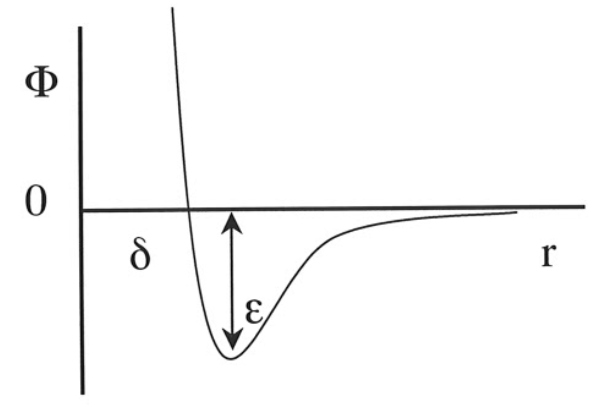
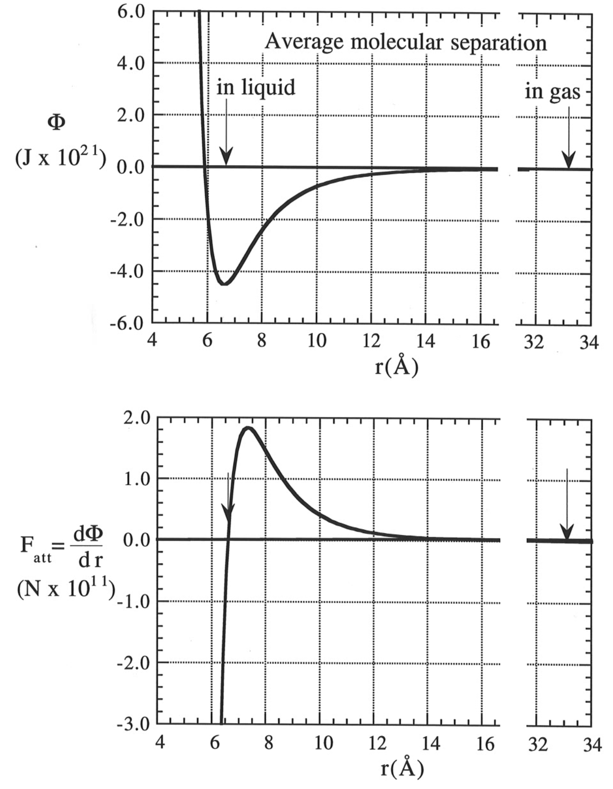
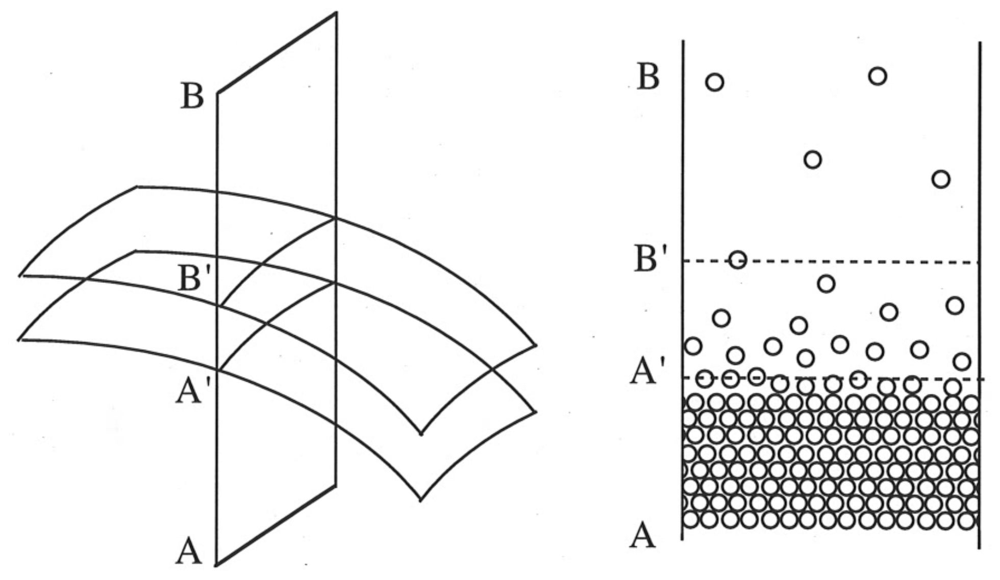
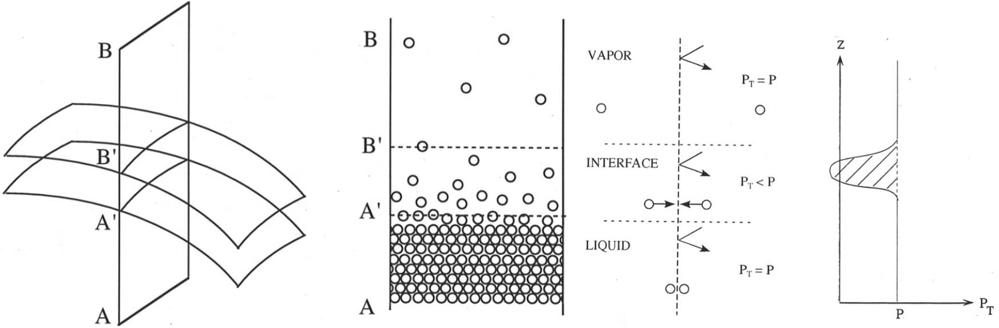
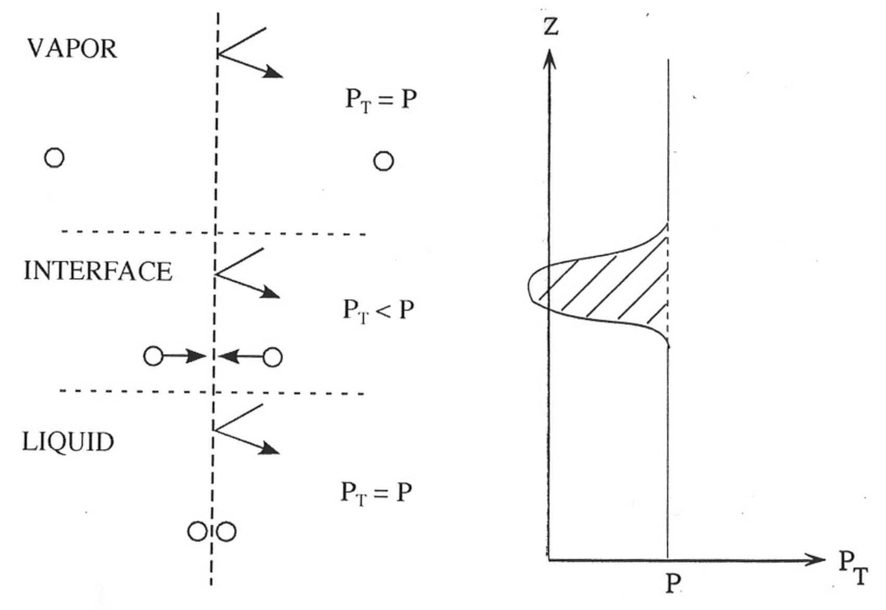

<!-- Marp for VS Code v1.5.2 -->

<!-- headingDivider: 2 -->

# Intermolecular Forces and   Origin of Surface Tension
<!-- _class: cover -->
Teng-Jui Lin
Department of Chemical Engineering, University of Washington
**Surface and Colloid Science**

## van der Waals forces are proportional to $r^{-6}$

- Keesom (dipole-dipole)
  - $\Phi_{\text{dip-dip}} = -\dfrac{B_{\text{polar}}}{r^6}$
- Debye (induced dipole-dipole)
  - $\Phi_{\text{ind}} = -\dfrac{B_{\text{ind}}}{r^6}$
- London (dispersion, induced-induced)
  - $\Phi_{\text{disp}} = -\dfrac{B_{\text{disp}}}{r^6}$

## Lennard-Jones potential accounts for attraction and repulsion
<!-- _class: twocol -->
- van der Waals attraction
  - $\Phi_{\text{attr}} = -\dfrac{B_{\text{vdW}}}{r^{6}}$
- Born repulsion
  - $\Phi_{\text{rep}} = -\dfrac{B_{\text{rep}}}{r^{12}}$
- Lennard-Jones potential
  - $\Phi = 4\varepsilon \left[ \left(\dfrac{\delta}{r}\right)^{12} - \left(\dfrac{\delta}{r}\right)^6 \right]$
- Attraction force
  - $F_{\text{attr}} = \dfrac{d\Phi}{dr} = -\dfrac{24\varepsilon}{r} \left[2\left(\dfrac{\delta}{r}\right)^{12} - \left(\dfrac{\delta}{r}\right)^6\right]$

## Surface tension as "unbalanced" intermolecular forces

- Inside bulk fluid, intermolecular forces are balanced, being in all directions
- At interface, intermolecular forces are inward only, being unbalanced

## Molecules at the interfacial layer experiences attraction forces

## Pressure deficit in the interfacial layer

- Pressure force at interface is decreased
  - Intermediate molecular separation cause strong attraction
  - $p_T$, pressure forces in lateral direction, is decreased

## Bakker's equation relates pressure deficit with interfacial tension
<!-- _class: twocol -->
- Bakker's equation
  - $\boxed{\sigma = \displaystyle\int_{-\infty}^{\infty} (p - p_T) dz}$
- Explains
  - Existance of $\sigma > 0$
  - $\sigma$-difference of diff liquids
  - Linear decrease of $\sigma$ with $T$
  - Decrease of $\sigma$ by surfactant
  - Thinness of interfacial layer (short range intermolecular force)

## Surface tension can be attributed to components of intermolecular interactions

- Components of surface tension

$$
\sigma = \quad \sigma^{\text{d}} \quad + \quad \sigma^{\text{p}} \quad + \quad \sigma^{\text{i}} \quad + \quad \sigma^{\text{h}} \quad + \quad \sigma^{\text{m}} \quad + \quad \cdots
$$

 

- Simplifications
  - $\sigma^{\text{p}} \approx 0$ (multibody self-cancellation)
  - $\sigma^{\text{i}} \approx 0$ (multibody self-cancellation)
  - $\sigma^{\text{h}} = \sigma^{\text{ab}}$ (Lewis acid-base self-association)
  - $\sigma^{\text{m}} = 0$ (if non-metallic system)
- Conclusions
  - $\boxed{\sigma = \sigma^{\text{d}} + \sigma^{\text{ab}}}$ (Liquids)
  - $\boxed{\sigma = \sigma^{\text{d}} + \sigma^{\text{m}}}$ (Molten metals)
