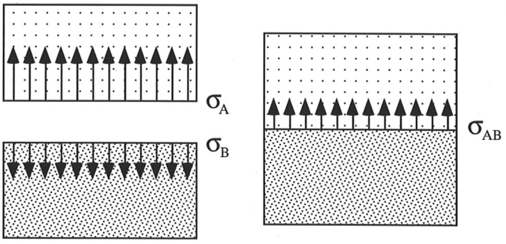

<!-- Marp for VS Code v1.5.2 -->

<!-- headingDivider: 2 -->
<!-- _class: cover -->
# Interfacial Tension Combining Rules

Teng-Jui Lin
Department of Chemical Engineering, University of Washington
**Surface and Colloid Science**

## Interfacial tension (L/L) can be estimated from surface tension (L/V)

## Combining rules of estimating interfacial tension (L/L) from surface tension (L/V)

- Antanov (1907)
  - For mutually saturated (soluble) components
  - $\boxed{\sigma_{AB} = \vert \sigma_{A(B)} - \sigma_{B(A)} \vert}$

&nbsp;

- Girifalco and Good (1957)
  - Correct for intermolecular interaction
  - $\boxed{\sigma_{AB} = \sigma_A + \sigma_B - 2 \Phi \sqrt{\sigma_A \sigma_B}}$

&nbsp;

- Fowkes (1964)
  - Correct for polar dispersion forces
  - Assume no acid-base interaction and H-bonding
  - $\boxed{\sigma_{AB} = \sigma_A + \sigma_B - 2 \sqrt{\sigma_A^{\mathrm{d}} \sigma_B^{\mathrm{d}}}}$