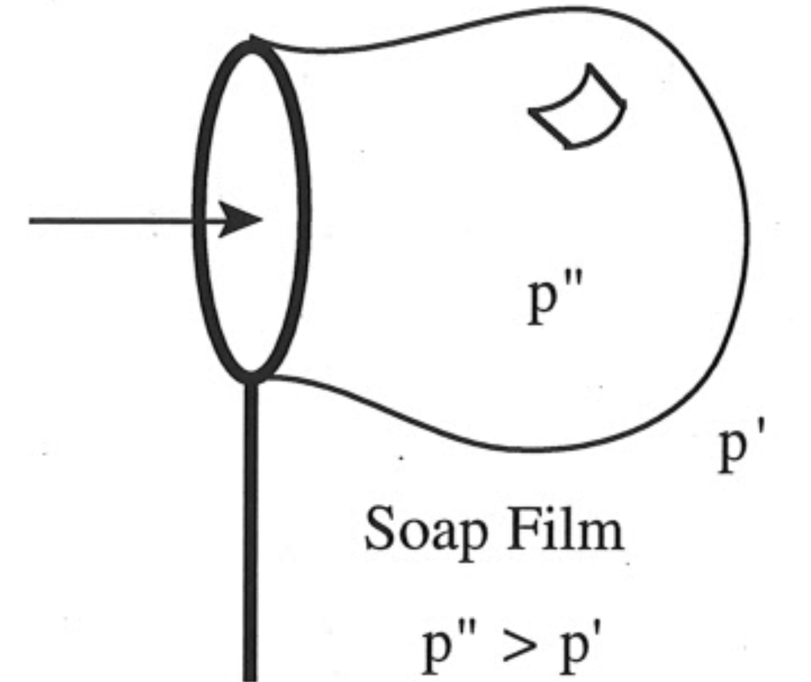
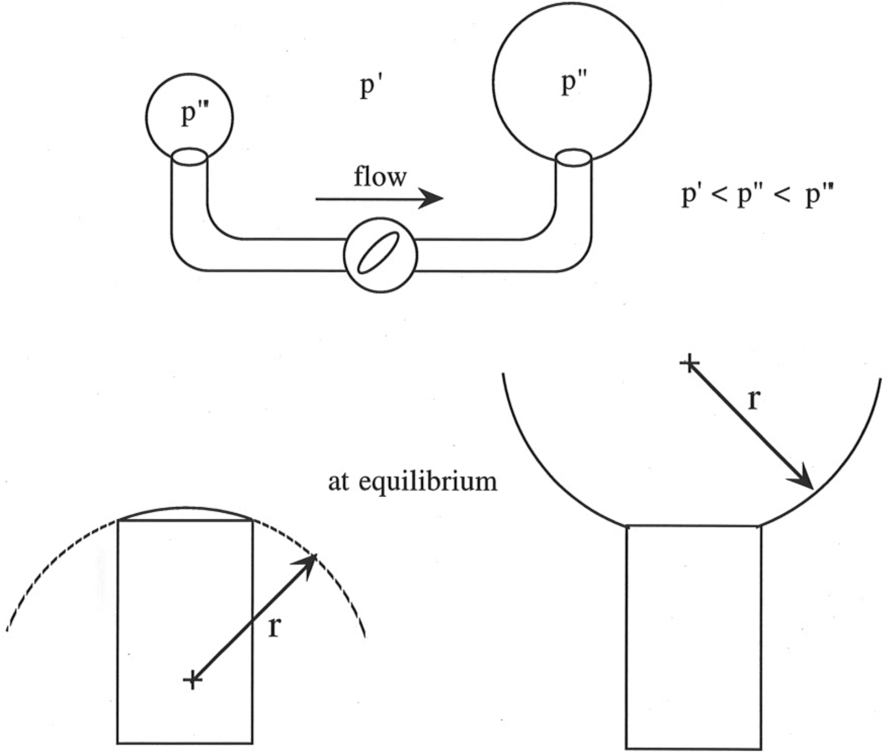

<!-- Marp for VS Code v1.5.2 -->

<!-- headingDivider: 2 -->
<!-- _class: cover -->
# Young-Laplace Equation

Teng-Jui Lin
Department of Chemical Engineering, University of Washington
**Surface and Colloid Science**

## Young-Laplace eqn requires a pressure difference across a curved fluid interface
<!-- _class: seventy -->
- Fluid interfaces assumes the lowest area (thus energy) configuration
- A pressure difference is required to sustain a fluid interface curvature
  - Higher pressure always on the concave side
  - $p_{\text{concave}} > p_{\text{convex}}$
- Young-Laplace Equation
  - $\boxed{\Delta p = \sigma\kappa}$
  - At a point on the interface
    - $\Delta p$ - Pressure difference
      - $\Delta p = p_{\text{concave}} - p_{\text{convex}}$
    - $\sigma$ - Surface tension
    - $\kappa$ - Curvature

## Young-Laplace equation describes spontaneous flow that equalizes curvature

- Two bubbles of unequal sizes have the same inner pressure $p''$ and outer pressure $p'$
  - What will happen when the valve opens?

