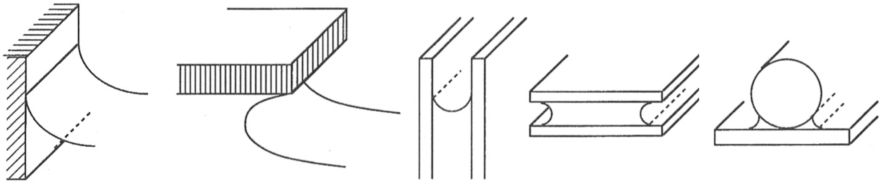

<!-- headingDivider: 2 -->
<!-- _class: cover -->
# Curvature of Surfaces

Teng-Jui Lin
Department of Chemical Engineering, University of Washington
**Surface and Colloid Science**

## Curvature in 2D: every point on a plane curve
<!-- _class: twocol -->

- $\kappa = \pm\dfrac{d\phi}{dS}$
- $\boxed{\kappa = \pm y'' [1 + (y'')^2]^{-3/2}}$

## Curvature in 2D: every point on a circle
<!-- _class: twocol -->

- $\boxed{\kappa = \dfrac{1}{R}}$

## Curvature in 3D: a point on a surface
<!-- _class: twocol -->

- $\kappa = \pm\left(\dfrac{1}{R_1} + \dfrac{1}{R_2}\right) = \pm\dfrac{2}{R_m}$

## Curvature in 3D: every point on a surface

$$\boxed{\kappa = \pm \dfrac{z_{xx}[1 + (z_y)^2] - 2 z_x z_y z_{xy} + z_{yy}[1 + (z_x)^2]}{[1 + (x_z)^2 + (z_y)^2]^{3/2}}}$$

## Special cases of 3D curvature: spheres and circular cylinders
<!-- _class: twocol -->
<!--  -->

- Sphere
  - $\boxed{\kappa = \dfrac{2}{R}}$
- Circular cylinder
  - $\boxed{\kappa = \dfrac{1}{R}}$

## Special cases of 3D curvature: general cylindrical surface

$$\boxed{\kappa = \pm y'' [1 + (y')^2]^{3/2}}$$

## Special cases of 3D curvature: axially symmetric surfaces

$$\boxed{\kappa = \pm \left[\dfrac{y''}{[1 + (y')^2]^{3/2}} + \dfrac{y'}{x[1 + (y')^2]^{1/2}}\right]}$$

## Special cases of 3D curvature: saddle-shaped surfaces

$$\boxed{\kappa = \pm \left[\dfrac{y''}{[1 + (y')^2]^{3/2}} - \dfrac{y'}{x[1 + (y')^2]^{1/2}}\right]}$$

## Hermitian and Gaussian curvature together uniquely define a surface
<!-- _class: twocol -->

- Hermitian curvature
  - $H = \dfrac{\kappa}{2} = \pm \dfrac{1}{2}\left(\dfrac{1}{R_1} + \dfrac{1}{R_2}\right)$
- Gaussian curvature
  - $\lambda = \pm \dfrac{1}{R_1 R_2}$

## Plateau's problem: minimal surface area with a given boundary

 &nbsp; 