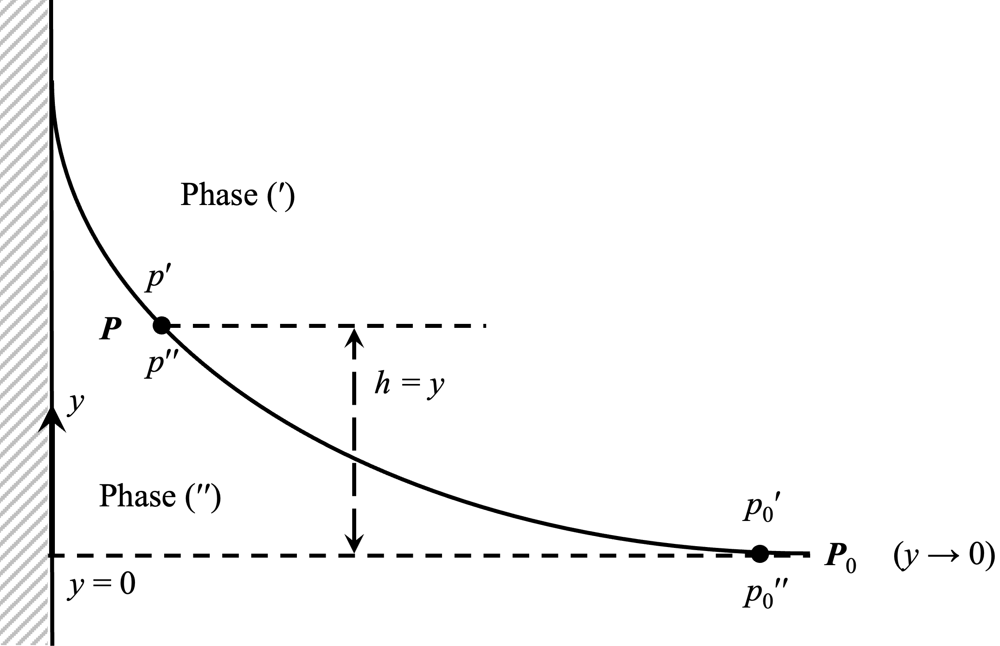

<!-- headingDivider: 2 -->
<!-- _class: cover -->
# Expressing the Pressure Difference across an Interface

Teng-Jui Lin
Department of Chemical Engineering, University of Washington
**Surface and Colloid Science**

## Pressure difference across an interface in *g*-field at a point is found by hydrostatics

$$
\boxed{\Delta p = \Delta p_0 - (\rho'' - \rho')gy}
$$

## Special cases of the Young-Laplace equation

- Spherical interface separating the same fluid
  - $\Delta p_0 = \dfrac{2\sigma}{R}$

   

- Circular cylinder interface separating the same fluid
  - $\Delta p_0 = \dfrac{\sigma}{R}$

## Special cases of the Young-Laplace equation

- General cylindrical surface separating different fluids
  - $\Delta p_0 - (\Delta\rho) gy = \pm \sigma \dfrac{y''}{[1 + (y')^2]^{3/2}}$

   

- Axially symmetric surface separating different fluids
  - $\Delta p_0 - (\Delta\rho) gy = \pm \sigma \left[\dfrac{y''}{[1 + (y')^2]^{3/2}} + \dfrac{y'}{x[1 + (y')^2]^{1/2}}\right]$
