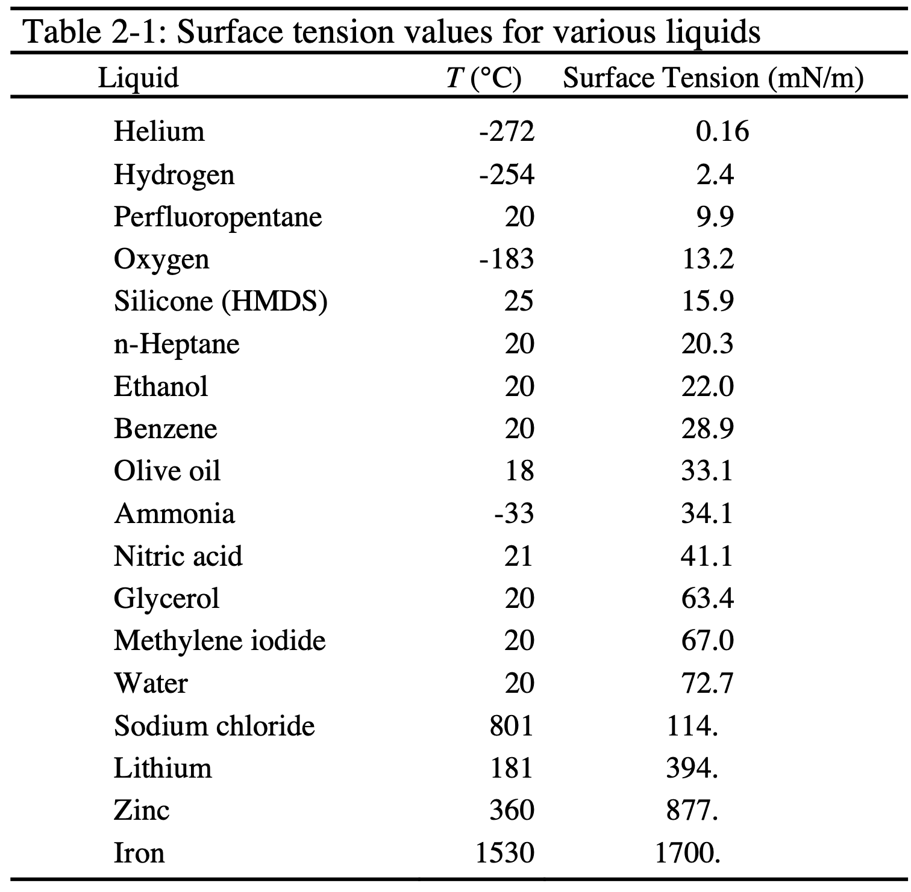
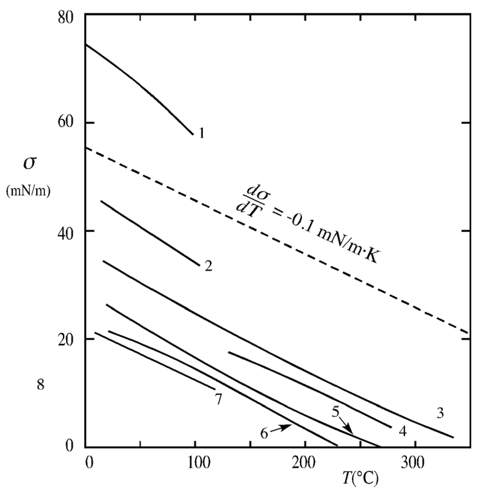
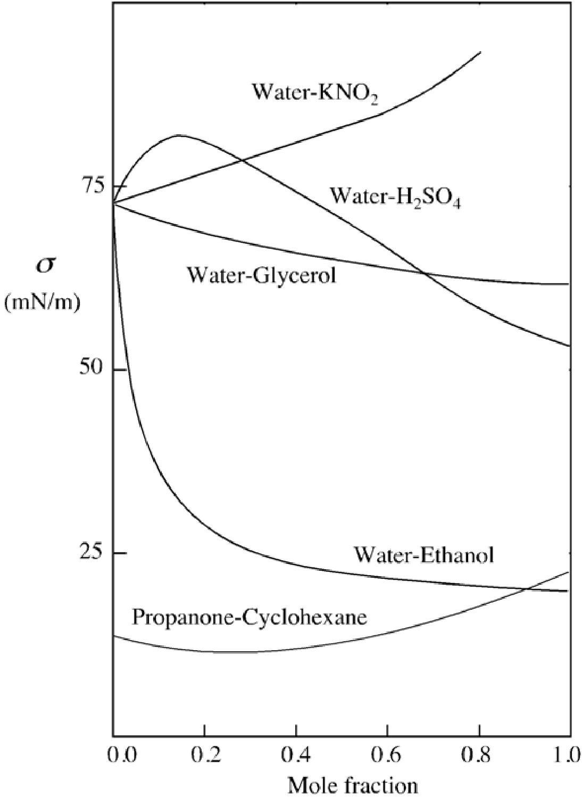
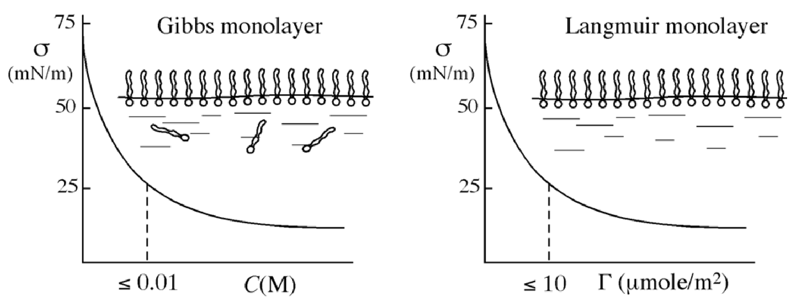
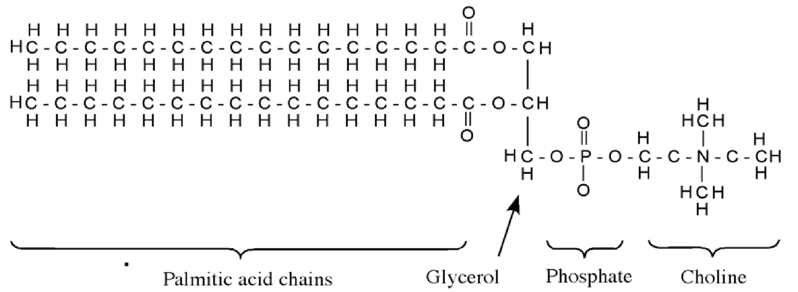

<!-- headingDivider: 2 -->
<!-- _class: cover -->
# Young's Membrane Model and   Liquid Surface Tensions

Teng-Jui Lin
Department of Chemical Engineering, University of Washington
**Surface and Colloid Science**

## Thinness of interfaces

## Mechanical definition of surface tension

- **Surface tension** - tension per unit length along the interface

$$
\boxed{\sigma = \dfrac{dF}{dL}}
$$

- Energy perspective: mechanical energy required to create new area of *liquid* surface
- **Young's membrane model** - a membrane of zero thickness in uniform isotropic tension
  - **Isotropic** - same in all directions
  - If surface has uniform composition and is isothermal, $\sigma$ is uniform throughout

## Surface tension of pure liquids
<!-- _class: twocol -->
- Assume pure liquid is in equilibrium with their vapor
  - In practice, in eqm with air has no difference
- Surface tension is a thermo property - need to specify $T$
  - Water ($T$ = 20°C), $\sigma$ = 72.7 mN/m
  - Mercury ($T$ = 20°C), $\sigma$ = 486 mM/m
- Liquified gas < organic liquid < H-bonded < molten salts < liquid metal

## Temperature dependence of surface tension $\sigma(T)$: linear decrease
<!-- _class: twocol -->
- At modest $T$, linear decrease
  - $$\boxed{\dfrac{d\sigma}{dT} = -0.1 \ \mathrm{mN/m \cdot K}}$$
- Empirical linear relation
  - $$\boxed{\sigma = a - bT}$$

## Temperature dependence of surface tension $\sigma(T)$: semi-empirical relations

- **Eotvos law**
  - $k_E \approx 2.5 \ \mathrm{erg/K} = 0.25 \ \mathrm{mJ/K}$

$$\boxed{\sigma v^{2/3} = k_E (T_c - T)}$$

- **Guggenheim law**
  - Apolar liquids
  - $\sigma^* = \dfrac{4.4 T_c}{v_c^{2/3}} \in [4.3, 4.5] \ \mathrm{dyne/cm}$

$$\boxed{\sigma = \sigma^* \left(1 - \dfrac{T}{T_c}\right)^{11/9}}$$

## Surface tension of solutions
<!-- _class: twocol -->
- $\sigma$ of solution is mostly intermediate to $\sigma$ of pure component
  - Extremum can exist due to complex formation
- $\sigma_{\mathrm{H_2O}} \uparrow$ with salt
- $\sigma_{\mathrm{H_2O}} \downarrow$ with organic solutes

## Surfactants decrease interfacial tension

- **Surface acting agent (surfactant)** - solute that $\downarrow\sigma_{\mathrm{H_2O}}$ by > 30 mN/m at concentration of < 0.01 M
  - **Gibbs (adsorbed) monolayer** - monomolecular layer at surface that is highly enriched in solute
  - **Langmuir (spread) monolayer** - monomolecular layer of insoluble surfactant at surface

## Lung surfactant is an insoluble surfactant

